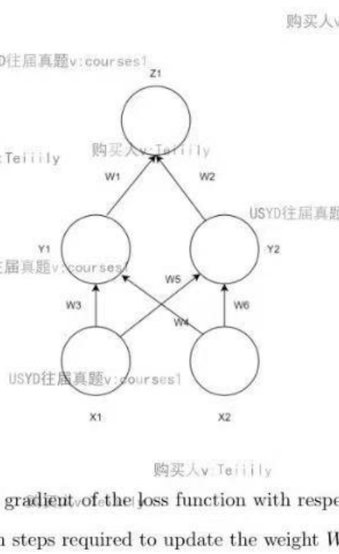
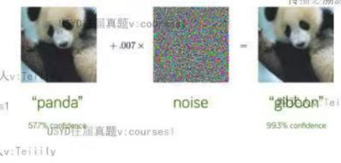
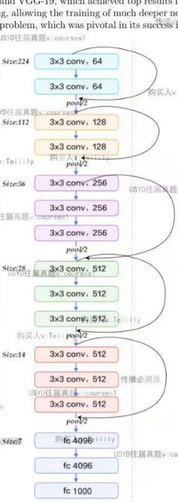
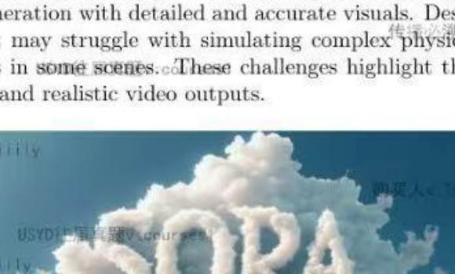

# COMP5329 Deep Learning — 以往真题（购买试卷）

> **考试格式**：Multiple choice + Short answer / coding（购买真题整理版）。  
> **配图**：`assets/` · Word 原件：`COMP5329_exam_questions_clean.docx`
>
> **用法**：先不看答案做完，再展开 `> [!success]- Answer` 对照「📌考点 / 大白话 / 得分点」。

---

## Multiple Choice Questions

**1.** What is an epoch in deep learning?

- (a) A measure of the model's accuracy on the training data.
- (b) One complete pass through the entire training dataset.
- (c) The number of layers in a neural network.
- (d) A type of optimization algorithm.

> [!success]- Answer
>
> **📌 考 W2 训练术语 epoch。** ✅「第一组」有。
>
> **大白话：** epoch = 把**整本训练集从头到尾练一遍**，不是准确率，也不是网络有几层。
>
> **得分点：**
> - **选 (b)** — One complete pass through the entire training dataset.
> - **(a) 错**：accuracy / loss 是评估指标，不是「一轮训练」的定义。
> - **(c) 错**：number of layers 是架构超参数。
> - **(d) 错**：SGD / Adam 是 **optimizer**，epoch 是训练进度单位（常与 **mini-batch** 区分：一个 epoch 含多个 batch）。

---

**2.** Given three matrices A, B, and C of dimensions m x n, n x p, and p x q respectively, which of the following represents the computational efficiency for the matrix multiplication (A x B) x C?

- (a) O(mnp)
- (b) O(npq)
- (c) O(mpq)
- (d) O(mnq)

> [!success]- Answer
>
> **📌 考 matrix multiplication 复杂度。** ⚠️ 笔记几乎没写，past paper 常考。
>
> **大白话：** 先算 $A\times B$，规模是 $m\times n$ 乘 $n\times p$，计算量 $\propto mnp$；再乘 $C$ 是另一项 $O(mpq)$。题目选项通常指**第一步**。
>
> **得分点：**
> - **选 (a) $O(mnp)$** — 左结合 $(A\times B)\times C$ 的第一步：$A_{m\times n}\times B_{n\times p}$。
> - 第二步 $(AB)_{m\times p}\times C_{p\times q}$ 为 $O(mpq)$；总代价 $O(mnp+mpq)$，选项常考第一步。
> - **(b)(d)** 维度或阶数不对；**(c)** 是第二步主导项时才成立。

---

**3.** How to calculate the size of a feature map after applying a convolutional layer followed by a pooling layer and then another convolutional layer?

- (a) Calculate the size after each layer sequentially, starting with the initial input.
- (b) Double the size after each convolutional layer.
- (c) Halve the size after each pooling layer.
- (d) The size remains the same after each layer.

> [!success]- Answer
>
> **📌 考 W4 conv / pool 逐层算尺寸。** ✅「第二组」+ 速查表。
>
> **大白话：** 不能心算「每层减半」——必须**从原图开始，一层层**代入 conv、pool 公式，上一层输出才是下一层输入。
>
> **得分点：**
> - **选 (a)** — 从 initial input 起 **sequentially** 算每一层。
> - Conv：$H_\text{out}=\lfloor(H+2P-K)/S\rfloor+1$；Pool：$H_\text{out}=\lfloor(H-K_\text{pool})/S_\text{pool}\rfloor+1$。
> - **(b)(c) 错**：不能默认「每层 conv 翻倍 / 每层 pool 减半」而不看 stride、padding。
> - **(d) 错**：pool / stride>1 的 conv 会改变 spatial size。

---

**4.** In Generative Adversarial Networks (GANs), when the discriminator is very strong and the training is sufficient, what is the expected output of the discriminator at a certain point?

- (a) 0
- (b) 0.5
- (c) 1
- (d) ∞

> [!success]- Answer
>
> **📌 考 W12 最优 discriminator $D^*$。** ✅「第四组」GAN。
>
> **大白话：** $D$ 太强时，最优情况是 $D^*(x)=\dfrac{p_r}{p_r+p_g}$，真假难分的地方输出接近 **0.5**（像抛硬币），不是 0 或 1，更不是无穷大。
>
> **得分点：**
> - **选 (b) 0.5**
> - 最优 **discriminator**（固定 $G$）：$D^*(x)=\dfrac{p_r(x)}{p_r(x)+p_g(x)}$；真假 **overlap** 时 $\approx 0.5$（**Bayes optimal**）。
> - **(a)(c)**：几乎确定假/真 → 支撑集几乎不重叠的极端，非本题典型均衡。
> - **(d) 错**：标准 GAN 的 $D$ 输出 **probability** $\in[0,1]$，不是 WGAN 的无界 **critic**。

---

**5.** Which of the following statements about Batch Normalization (BN) is correct?

- (a) Batch Normalization can be used at the input layer.
- (b) Batch Normalization eliminates the need for dropout.
- (c) Batch Normalization decreases the model's overall complexity.
- (d) Batch Normalization is only applicable to fully connected layers.

> [!success]- Answer
>
> **📌 考 W3 BN 说法。** ✅「第一组」。
>
> **大白话：** BN 可以放在包括 **input** 在内的各层；**不能替代 Dropout**；也不减少参数量；CNN 里同样常用。
>
> **得分点：**
> - **选 (a)** — BN **can be used at the input layer**（对 feature 做 per-dim 归一化）。
> - **(b) 错**：BN 与 **Dropout** 机制不同，**不能替代**。
> - **(c) 错**：BN 增加 $\gamma,\beta$，不降低 **model complexity**。
> - **(d) 错**：BN 广泛用于 **CNN**（在 $(N,H,W)$ 维算 mean/var）和 FC。

---

**6.** Given an image of size 256 x 256, what is the output size after applying three layers: one convolutional layer, one pooling layer, and then another convolutional layer? Assume all convolutional layers have a stride of 1 and padding that maintains the spatial dimensions, and the pooling layer has a stride of 2.

- (a) 256 x 256
- (b) 128 x 128
- (c) 64 x 64
- (d) 32 x 32

> [!success]- Answer
>
> **📌 考 W4 feature map 数值。** ✅「第二组」。
>
> **大白话：** conv(s=1, same pad) 尺寸不变 → 256；pool(s=2) 减半 → **128**；再 conv(s=1, same) 仍 128。
>
> **得分点：**
> - **选 (b) 128×128**
> - Layer1 Conv：256→256（stride=1, same padding）
> - Layer2 Pool stride=2：256→128
> - Layer3 Conv：128→128
> - **(a)** 忽略 pool；**(c)(d)** 多除了一次 2

---

**7.** Which of the following statements about Long Short-Term Memory (LSTM) networks is correct?

- (a) LSTMs can only process sequences of fixed length.
- (b) LSTMs are designed to remember long-term dependencies in sequence data.
- (c) LSTMs do not have an internal memory state.
- (d) LSTMs are always faster than traditional RNNs.


> [!success]- Answer
>
> **📌 考 W7 LSTM 作用。** ✅「第三组」。
>
> **大白话：** LSTM 用 **cell state** 和门控记**长程信息**；可变长序列；有记忆；通常比 vanilla **RNN** **更慢**。
>
> **得分点：**
> - **选 (b)** — remember **long-term dependencies** in sequence data.
> - 机制：**cell state** $c_t$ + **forget / input / output gates**；**additive** 更新缓解 **vanishing gradient**。
> - **(a) 错**：可变长，非 fixed length only。
> - **(c) 错**：有 **internal memory**（$c_t$）。
> - **(d) 错**：多组 gate + 矩阵乘，通常 **slower** than RNN，不是 faster。

---

## Short Answer / Coding Questions

### Question 1 — Backpropagation

Given the following neural network with two input neurons X1 and X2, two hidden neurons Y1 and Y2, and one output neuron Z. The weights of the connections are W1, W2, W3, W4, W5, and W6. The relationship between the neurons and weights is defined as:

$$Z = W_1 \cdot Y_1 + W_2 \cdot Y_2$$

and we need to minimize the loss function:

$$L = \|Z - t\|^2$$

where t is the target output.



1. Derive the expression for the gradient of the loss function with respect to the weight W5.

2. Describe the backpropagation steps required to update the weight W5.

> [!success]- Answer
>
> **📌 考 W2 chain rule / backprop。** ✅「第一组」Backprop。
>
> **大白话：** 题图里 $W_5$ 连在 $X_1\to Y_2$。损失 $L=\|Z-t\|^2$。求 $W_5$ 的梯度要**从 $L$ 一路链式法则传回去**，经过 $Z\to Y_2\to \text{net}_{Y_2}\to W_5$，别忘了隐藏层激活 $f$ 的导数 $f'$。
>
> **得分点：**
>
> **(1) 梯度（须写出 chain rule 四项）**
>
> 前向：$\text{net}_{Y_2}=W_5 X_1+W_6 X_2$，$Y_2=f(\text{net}_{Y_2})$，$Z=W_1 Y_1+W_2 Y_2$，$L=(Z-t)^2$。
>
> $$\frac{\partial L}{\partial W_5}=\underbrace{2(Z-t)}_{\partial L/\partial Z}\cdot\underbrace{W_2}_{\partial Z/\partial Y_2}\cdot\underbrace{f'(\text{net}_{Y_2})}_{\partial Y_2/\partial \text{net}}\cdot\underbrace{X_1}_{\partial \text{net}/\partial W_5}$$
>
> 或 $\delta_{Y_2}=\dfrac{\partial L}{\partial \text{net}_{Y_2}}$，$\dfrac{\partial L}{\partial W_5}=\delta_{Y_2} X_1$。
>
> **(2) Backprop 更新 $W_5$（须写清顺序）**
>
> ① **Forward**：算 $\text{net}_{Y_1},Y_1,\text{net}_{Y_2},Y_2,Z,L$；**cache** $X_1,\text{net}_{Y_2},f'(\text{net}_{Y_2})$。  
> ② $\dfrac{\partial L}{\partial Z}=2(Z-t)$。  
> ③ $\delta_{Y_2}=\dfrac{\partial L}{\partial Z}\cdot W_2\cdot f'(\text{net}_{Y_2})$。  
> ④ $\dfrac{\partial L}{\partial W_5}=\delta_{Y_2}\cdot X_1$。  
> ⑤ **SGD**：$W_5\leftarrow W_5-\eta\,\dfrac{\partial L}{\partial W_5}$。
>
> **与速查表**：Q1 是**推导/步骤题**，不是 PyTorch。链式写法对应 `手写代码速查表` → <span style="color:#c0392b">Week3</span> `HiddenLayer.backward` `★★★`（同一套 $\delta$、$dW=\delta^\top X$ 逻辑）；先默 Week3 再套到题图指定权重 $W_5$。
>
> ```python
> # 伪代码（考场写数学为主；此块帮助对照 Week3 手推）
> # Forward
> net_Y2 = W5 * X1 + W6 * X2
> Y2 = f(net_Y2)
> Z = W1 * Y1 + W2 * Y2
> L = (Z - t) ** 2
>
> # Backward（更新 W5）
> dL_dZ = 2 * (Z - t)
> delta_Y2 = dL_dZ * W2 * f_prime(net_Y2)
> dL_dW5 = delta_Y2 * X1
> W5 = W5 - lr * dL_dW5
> ```

---

---

### Question 2 — Adversarial Attacks

A photograph of a panda initially has a 57.7% confidence score for being classified as a panda by a deep learning model. However, after adding a layer of noise that is imperceptible to the human eye, the model misclassifies it with 99.3% confidence as a gibbon.



1. Why would this happen as the confidence score increases? Describe two methods to defend against such adversarial attacks. For each method, discuss its advantages and disadvantages.

2. There are various techniques that can be employed to make predictions in the context of adversarial attacks. Identify two methods that can be used for making predictions in adversarial settings. For each method, discuss its strengths and weaknesses.

> [!success]- Answer
>
> **📌 考 adversarial example / FGSM、defense。** ❌ 笔记**无专章**（≠ GAN 的 adversarial training）。
>
> **大白话：** 加一层人眼看不见的噪声，图像却越过模型的**决策边界**，被**高 confidence** 判错类——因为边界在高维上很「脆」。防御要么训练时就喂对抗样本，要么预测时加噪声/检测再拒识。
>
> **得分点：**
>
> **(1) 为何 confidence 更高地错分**
>
> - **Decision boundary** 在高维近似 **linear / fragile**。
> - **Adversarial attack**（如 **FGSM**）：$x_\text{adv}=x+\epsilon\,\mathrm{sign}(\nabla_x L(\theta,x,y))$，$\epsilon$ 小 → **imperceptible noise**。
> - 样本越过边界进入错误类区域 → **softmax confidence** 在错误类上可**更高**。
>
> **(2) 两种 Defense（各写 mechanism + 优缺点）**
>
> | 方法 | 得分点 |
> |------|--------|
> | **Adversarial training** | 训练时最小化 $(x_\text{adv},y)$ 的 loss → 提高 **robustness**；优点：直接；缺点：训练成本高、对未见攻击泛化有限 |
> | **Defensive distillation** | 用高温 **soft labels** 训学生网，平滑 **decision boundary**；优点：推理不额外变慢；缺点：**adaptive attack** 仍可能破 |
>
> **(3) 两种 Prediction under attack**
>
> | 方法 | 得分点 |
> |------|--------|
> | **Randomized smoothing** | 多次加噪 **forward** 平均/投票；**certified robustness**；缺点：推理慢 |
> | **Adversarial detection + reject** | 检测 **adversarial example** 后拒识；优点：易部署；缺点：**false reject**、detector 可被攻击 |

---

---

### Question 3 — CNNs and Vision Transformers

Deep learning models have evolved significantly, with architectures like Convolutional Neural Networks (CNNs) and Vision Transformers (ViTs) being at the forefront of computer vision tasks. CNNs leverage convolutional layers to extract local features through shared weights, while ViTs utilize self-attention mechanisms to capture both local and global dependencies. Understanding the fundamental differences between these two architectures and how they process information is crucial for advancing in the field.

Additionally, there is ongoing research into whether traditional CNNs can be adapted to learn global features akin to those captured by attention mechanisms in transformers. One proposed method involves increasing the filter size in CNNs significantly.

1. Fundamentally, what are the differences between the self-attention layers in Vision Transformers (ViTs) and the convolutional layers in Convolutional Neural Networks (CNNs)? How do these differences affect the way each model processes information?

2. Consider a VGG-like network where the filter size is changed from 3 x 3 to 21 x 21, or another similarly larger size. Can this adjustment mimic the attention mechanism to learn global features? Discuss the potential effectiveness and limitations of this approach.

> [!success]- Answer
>
> **📌 考 W4 CNN vs W8 ViT / inductive bias。** ✅「第二组」+「第三组」。
>
> **大白话：** CNN 默认「附近像素相关、模式可平移」；ViT 把图切成 patch，用 **self-attention** 任意两块都能互看，但要 **positional encoding**，小数据常吃亏。把 conv 核从 3×3 改成 21×21 只是看得更远，权重仍是死的，不像 attention 按内容动态加权。
>
> **得分点：**
>
> **(1) Self-attention (ViT) vs Convolutional layer (CNN)**
>
> | 维度 | CNN | ViT |
> |------|-----|-----|
> | 连接 | **Local receptive field**，**weight sharing** | **Global self-attention**，任意 patch 两两交互 |
> | Inductive bias | **Locality** + **translation equivariance**（强） | 弱；需 **positional encoding** |
> | 数据 | 小数据常更好 | 常需大数据 |
> | 计算 | 约 $O(HWk^2C)$ | $O(T^2)$，$T$=patch 数 |
>
> **(2) 21×21 conv 能否 mimic attention？**
>
> - 部分：receptive field 变大，单层可见更远区域。
> - **不能真正 mimic**：权重**静态、共享**，非 **content-based** 的 $QK^\top$；参数量 $\propto k^2$；无 **dynamic pairwise** 交互 → 只是粗糙 global 近似。

---

---

### Question 4 — LSTM Regularization and Gradients

1. What are some common methods to regularize LSTM networks? Discuss the advantages and disadvantages of each method.

2. Explain why LSTMs are able to avoid the problem of gradient explosion more effectively than traditional RNNs.

> [!success]- Answer
>
> **📌 考 W7 LSTM + W3 正则。** ⚠️ 正则「第一组」全；**gradient clipping** 第三组只提一句。
>
> **大白话：** 防 LSTM 过拟合：Dropout、L2、早停都行；RNN 训练常还要 **gradient clipping** 防止梯度爆炸。LSTM 比 RNN 不容易梯度消失，是因为 cell state **用加法更新**，遗忘门 $f_t$ 可学≈1，梯度能「直通」；但爆炸仍可能发生，所以要 clip。
>
> **得分点：**
>
> **(1) 四种 regularization（各一句 mechanism + 优缺点）**
>
> | 方法 | 得分点 |
> |------|--------|
> | **Dropout** | 训练随机置零；减 **co-adaptation** / **overfitting**；缺点：LSTM 内慎用 **cell state**，**recurrent dropout** 复杂，可能伤 **long-term memory** |
> | **L2 weight decay** | loss $+\lambda\|\theta\|^2$；简单稳定；缺点：均匀缩权重，可能 **underfit**，不 **sparse** |
> | **Early stopping** | **validation loss** 不降则停；**implicit regularization**；缺点：调 **patience**，可能早停 |
> | **Gradient clipping** | $\|\nabla\|\le\tau$；专治 **gradient explosion**；缺点：不直接防 overfit，要调 $\tau$ |
>
> **(2) LSTM vs RNN — gradient explosion / vanishing**
>
> - **Vanilla RNN**：BPTT 连乘 $\prod_t \tanh'(\cdot)\,W_{hh}$ → **vanishing**（因子 $<1$）或 **exploding**（$\|W_{hh}\|$ 大）。
> - **LSTM**：$c_t=f_t\odot c_{t-1}+i_t\odot\tilde c_t$ — **additive** 路径；**forget gate** $f_t=\sigma(\cdot)$ 可学 $\approx 1$ → 梯度可长期传递 → **主要缓解 vanishing**。
> - **注意**：LSTM **不消除 exploding**；实践仍配 **gradient clipping**。

---

---

### Question 5 — GCNs, CNNs, and Transformers

1. Compare and contrast the application of Graph Convolutional Networks (GCNs) and Convolutional Neural Networks (CNNs) in image recognition tasks. Discuss the fundamental differences in how each network processes image data. In what situations might GCNs provide an advantage over CNNs for image recognition? Consider examples where the relationships between pixels or image regions are better represented as a graph.

2. Compare and contrast Convolutional Neural Networks (CNNs) and Transformers. Discuss their primary purposes, fundamental components, and typical applications in the context of computer vision and other fields.

> [!success]- Answer
>
> **📌 考 W5 GCN + W4 CNN + W8 Transformer。** ✅「第二组」+「第三组」。
>
> **大白话：** 普通照片用 CNN 扫网格就行；像素关系像图（场景图、超像素）可用 GCN 聚合邻居。Transformer 则让任意 token 互相看，适合 NLP/ViT，但通常要更多数据。
>
> **得分点：**
>
> **(1) GCN vs CNN（image recognition）**
>
> - **CNN**：规则 **grid**；**convolution** = 局部邻域 + **translation equivariance**；隐含四邻接。
> - **GCN**：**graph** $G=(V,E)$；**message passing** $\tilde D^{-1/2}\tilde A\tilde D^{-1/2} H W$；**permutation equivariant** on nodes。
> - **GCN 优势场景**：**scene graph**、**superpixel graph**、点云 k-NN、非网格拓扑；常规自然图分类仍用 **CNN**。
>
> **(2) CNN vs Transformer**
>
> - **Purpose**：CNN → 局部→全局层次视觉特征；Transformer → 任意位置 **global dependency**。
> - **Components**：CNN = conv + pool + FC；Transformer = **multi-head self-attention** + **FFN** + **positional encoding** + residual/LN。
> - **Applications**：CNN — 检测/分割（ResNet, U-Net）；Transformer — **ViT**, **BERT/GPT**, 多模态。

---

---

### Question 6 — Overfitting and Dropout

1. What are some techniques to mitigate overfitting in machine learning models? For each strategy, provide a brief explanation of how it works and discuss its advantages and disadvantages as discussed in the Week 4 lecture.

2. How does dropout improve the robustness of a neural network model? Discuss the mechanisms through which dropout enhances the model’s ability to generalize to new, unseen data.

> [!success]- Answer
>
> **📌 考 W3 overfitting / dropout。** ✅「第一组」。
>
> **大白话：** 过拟合 = 背训练集噪声。靠 L2、Dropout、增广、早停等压住。Dropout 训练时随机「请假」神经元，逼每个神经元自己学会干活，测试时用整网，等于很多子模型的平均，所以 **generalization** 更好。
>
> **得分点：**
>
> **(1) Mitigate overfitting（至少列 3–4 种 + 优缺点，Week 4 语境）**
>
> | 策略 | Mechanism | 优点 | 缺点 |
> |------|-----------|------|------|
> | **L1/L2** | 惩罚 $\|\theta\|$；L1 → **sparse** | 简单 | L2 可能 underfit |
> | **Dropout** | 随机断连；**inverted**：训练 $\div(1-p)$，测试不 drop | 强正则 | 训练慢；与 BN 同层需谨慎 |
> | **BN** | 归一化激活 | 加速+轻微正则 | batch 小不稳 |
> | **Data augmentation** | 扩分布 | 不改模型 | 需领域设计 |
> | **Early stopping** | 监控 **validation** | 零额外参数 | patience；可能局部最优 |
>
> **(2) Dropout → generalization（两个视角都要提到）**
>
> - **Ensemble**：训练 $2^n$ 个 **sub-networks** 的近似；测试用整网 ≈ 平均预测。
> - **Co-adaptation**：神经元不能依赖固定搭档，学更独立、可迁移特征 → 对 **unseen data** 更好 **generalization**。

---

---

### Question 7 — VGG / ResNet / PyTorch

VGG (Visual Geometry Group) and ResNet (Residual Networks) are prominent CNN architectures used in image classification tasks. VGG is characterized by its simplicity, employing small 3 x 3 filters across deep networks, exemplified by VGG-16 and VGG-19, which achieved top results in the ILSVRC 2014 competition. ResNet introduced residual learning, allowing the training of much deeper networks by using skip connections to mitigate the vanishing gradient problem, which was pivotal in its success in the ILSVRC 2015 competition.



1. Implement the above block as a subclass of PyTorch nn.Module.

```python
class VGG(nn.Module):    def __init__(self, in_channels):        # Your code here.    def forward(self, x):        # Your code here.
```

2. Implement the code to perform any data preprocessing or data augmentations in torchvision.transforms and encapsulate the process as an instance of transforms.Compose. You need to resize the image into the shape 224 x 224, randomly flip the images horizontally, and scale the RGB values into the range [0, 1].

```python
transforms = transforms.Compose([...])dataset = torchvision.datasets.ImageNet('path', transform=transforms)data_loader = ...
```

3. Implement the code to train the dataset for 100 epochs. Validate the model every 5th epoch and print the validation accuracy to the standard output. Perform early stopping when overfitting is detected. Save the model to the current working directory as a file named inception.pth every 10th epoch.

> [!success]- Answer
>
> **📌 代码来源**：Materials `Week5_CNN.ipynb` §7 + §0–1；理论见复习笔记「第二组」ResNet。  
> **与速查表**：`手写代码速查表.md` → <span style="color:#e67e22">Week5</span>（§7 `BasicBlock` `★★★`、§0–1、`train_model` `★★`）；卷子 (2)(3) 题干细节见**本题下方完整代码**。
>
> **大白话：** 题面写 VGG、图是 **ResNet block**。两路 3×3 conv + BN，最后 **加 shortcut**；数据用 `Compose`；训练循环在 Tutorial `train_model` 上加上「每 5 验证、早停、每 10 存盘」。
>
> ---
>
> ### 能否只靠代码速查表学 Q7？
>
> | 小问 | 速查表能否覆盖 | 说明 |
> |------|----------------|------|
> | (1) `nn.Module` | ✅ 能 | Week5 §7 `BasicBlock` 与卷子一致；类名可写 `ResidualBlock` 或题目里的 `VGG`（实现仍是 residual） |
> | (2) `transforms` | ⚠️ 差一步 | §0–1 是 MNIST 版；**卷子 224+flip+[0,1]** 见下方完整代码 |
> | (3) 训练循环 | ⚠️ 差一步 | §7 `train_model` 无「每 5 val / early stop / 每 10 save」；见下方完整代码 |
>
> **推荐学法**：先默速查表 Week5 `★★★` 的 `BasicBlock` + `train_model` → 再背**本题下方** (2)(3) 卷子版（约 10 分钟）。速查表暂不改，卷子多出来的写在答案里。
>
> ---
>
> ### (1) 完整代码 · Residual Block（`nn.Module`）
>
> ```python
> import torch
> import torch.nn as nn
> import torch.nn.functional as F
>
>
> class ResidualBlock(nn.Module):
>     """题图：两路 3×3 Conv + BN；输出 F(x) + shortcut(x)。卷子类名可写 VGG(nn.Module)，逻辑相同。"""
>
>     def __init__(self, in_channels, out_channels, stride=1):
>         super().__init__()
>         self.conv1 = nn.Conv2d(in_channels, out_channels, kernel_size=3,
>                                stride=stride, padding=1, bias=False)
>         self.bn1 = nn.BatchNorm2d(out_channels)
>         self.conv2 = nn.Conv2d(out_channels, out_channels, kernel_size=3,
>                                stride=1, padding=1, bias=False)
>         self.bn2 = nn.BatchNorm2d(out_channels)
>
>         if stride != 1 or in_channels != out_channels:
>             self.shortcut = nn.Sequential(
>                 nn.Conv2d(in_channels, out_channels, kernel_size=1,
>                           stride=stride, bias=False),
>                 nn.BatchNorm2d(out_channels),
>             )
>         else:
>             self.shortcut = nn.Identity()
>
>     def forward(self, x):
>         out = F.relu(self.bn1(self.conv1(x)))
>         out = self.bn2(self.conv2(out))
>         out = out + self.shortcut(x)
>         return F.relu(out)
> ```
>
> **得分关键词**：`F(x)+x`、**skip connection**、channel/stride 不等时 **1×1 conv** 对齐。
>
> ---
>
> ### (2) 完整代码 · `transforms` + `DataLoader`
>
> ```python
> import torchvision
> from torchvision import transforms
>
> transform = transforms.Compose([
>     transforms.Resize((224, 224)),
>     transforms.RandomHorizontalFlip(),
>     transforms.ToTensor(),              # float32, RGB ∈ [0, 1]
> ])
>
> dataset = torchvision.datasets.ImageNet(
>     root="path/to/imagenet",
>     split="train",
>     transform=transform,
> )
> data_loader = torch.utils.data.DataLoader(
>     dataset,
>     batch_size=32,
>     shuffle=True,
>     num_workers=4,
> )
> ```
>
> **注意**：卷子要 **[0, 1]** → 用 `ToTensor()`，**不要**再加 `Normalize`（除非题干明确要求 ImageNet mean/std）。
>
> ---
>
> ### (3) 完整代码 · 训练 100 epochs（含 val / early stop / 存盘）
>
> ```python
> def accuracy(model, loader, device):
>     model.eval()
>     correct = total = 0
>     with torch.no_grad():
>         for x, y in loader:
>             x, y = x.to(device), y.to(device)
>             correct += (model(x).argmax(1) == y).sum().item()
>             total += y.size(0)
>     return correct / total
>
>
> def train_with_val(model, train_loader, val_loader, device="cuda",
>                    n_epochs=100, lr=1e-3, patience=5):
>     model.to(device)
>     optimizer = torch.optim.Adam(model.parameters(), lr=lr)
>     criterion = nn.CrossEntropyLoss()
>
>     best_val_acc = 0.0
>     best_state = None
>     no_improve = 0
>
>     for epoch in range(1, n_epochs + 1):
>         # ── Train ──
>         model.train()
>         for x, y in train_loader:
>             x, y = x.to(device), y.to(device)
>             optimizer.zero_grad()
>             loss = criterion(model(x), y)
>             loss.backward()
>             optimizer.step()
>
>         # ── Validate every 5 epochs（题干要求）──
>         if epoch % 5 == 0:
>             val_acc = accuracy(model, val_loader, device)
>             print(f"Epoch {epoch}  validation accuracy: {val_acc:.4f}")
>
>             if val_acc > best_val_acc:
>                 best_val_acc = val_acc
>                 best_state = {k: v.cpu().clone() for k, v in model.state_dict().items()}
>                 no_improve = 0
>             else:
>                 no_improve += 1
>
>             if no_improve >= patience:
>                 print(f"Early stopping at epoch {epoch} (best val acc={best_val_acc:.4f})")
>                 break
>
>         # ── Save every 10 epochs（题干文件名）──
>         if epoch % 10 == 0:
>             torch.save(model.state_dict(), "inception.pth")
>
>     if best_state is not None:
>         model.load_state_dict(best_state)
>     return model
>
>
> # 使用示例
> device = torch.device("cuda" if torch.cuda.is_available() else "cpu")
> model = ResidualBlock(in_channels=64, out_channels=64)   # 或你的完整分类网络
> model = train_with_val(model, train_loader, val_loader, device=device)
> ```
>
> **得分点对照题干**：
>
> | 题干 | 代码里对应 |
> |------|------------|
> | 100 epochs | `n_epochs=100` |
> | every 5th epoch validate + print | `if epoch % 5 == 0:` + `print(... val_acc ...)` |
> | early stopping when overfitting | `no_improve` / `patience` + `break` + `load_state_dict(best)` |
> | save `inception.pth` every 10th epoch | `if epoch % 10 == 0: torch.save(...)` |
>
> **与 Materials 差别**：Tutorial `train_model` 每 epoch 在 **test** 上算 acc、默认 3 epoch；卷子用 **validation**、100 epoch、早停、定期存盘——以**题干**为准，上方脚本已对齐购买卷。

---

---

### Question 8 — Sora / Text-to-Video Models

OpenAI’s Sora is a cutting-edge text-to-video model capable of generating high-definition videos from textual descriptions. Released in February 2024, Sora uses advanced diffusion techniques to convert text prompts into videos that can be up to one minute long. It is built on the technology behind OpenAI’s DALL-E 3, allowing for complex scene generation with detailed and accurate visuals. Despite its impressive capabilities, Sora has some limitations. It may struggle with simulating complex physical interactions and accurately depicting spatial relationships in some scenes. These challenges highlight the ongoing need for refinement and testing to ensure reliable and realistic video outputs.



1. Discuss the types of video data needed, including both AI-generated videos from Sora and human-generated videos.

2. Describe how you would process and preprocess the video data, such as frame extraction, resizing, normalization, and possibly converting video data to feature vectors or embeddings.

3. Sora is using diffusion models to generate frame-by-frame pictures. Discuss why OpenAI is not using GAN models in text-to-video tasks.

4. Sora does not support generating audio in video right now. How would you change the model architecture to support video with audio in future?

5. Identify and analyze the limitations of Sora in accurately depicting spatial relationships and complex physical interactions. How might these limitations impact its effectiveness in certain applications?

> [!success]- Answer
>
> **📌 考 text-to-video、diffusion vs GAN。** ❌ Sora 笔记无；**diffusion vs GAN** 可蹭 W12「第四组」。
>
> **大白话：** Sora 类模型要大量「视频+文字」配对；先抽帧再 resize 归一化。长视频用 **diffusion** 比 **GAN** 稳、不容易 mode collapse。加声音要多一条 audio 分支或 joint 训练。弱点是物理和空间关系常胡来，仿真类场景要小心。
>
> **得分点：**
>
> **(1) Video data types**
>
> - **Human-generated**：真实运动、物理、光照；作 **ground truth**。
> - **AI-generated (Sora)**：蒸馏/增广/偏好对齐；须标来源，防 **bias amplification** / **model collapse**。
> - 需 **text–video paired** captions；负样本/安全数据用于 moderation。
>
> **(2) Preprocessing pipeline**
>
> - **Frame extraction**（固定 FPS 或 shot detection）
> - **Resize** / **normalization**（per-channel mean/std 或 $[-1,1]$）
> - 可选：**VAE latent** 降维供 **diffusion** 在 latent 空间生成
> - Text → **text encoder**（T5/CLIP）→ **conditioning embedding**
>
> **(3) Why diffusion, not GAN（text-to-video）**
>
> | | **Diffusion** | **GAN** |
> |---|---------------|---------|
> | Training | **Denoising** MSE，稳定 | **Adversarial** minimax，不稳定 |
> | Diversity | **Mode coverage** 较好 | **Mode collapse** 风险 |
> | Conditioning | 易注入 text / frame | 需额外设计 |
> | Scale | **Spacetime** patch + iterative denoise | 长序列高分辨率难 |
>
> **(4) Add audio**
>
> - **Dual-branch diffusion**（video latent + audio latent）+ **cross-attention**（lip-sync）
> - 或 **joint multimodal transformer**；训练需 **audio–video aligned** 数据
>
> **(5) Limitations & impact**
>
> - **Spatial relationships**（遮挡、相对位置）常错
> - **Physical interactions**（碰撞、重力、流体）不符合物理
> - 影响：**robotics simulation**、医疗/工程仿真、需精确几何的应用不可靠

---

