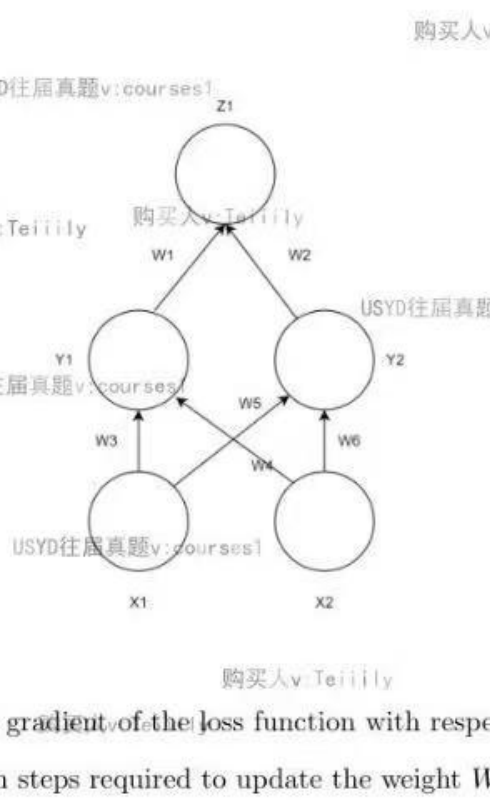
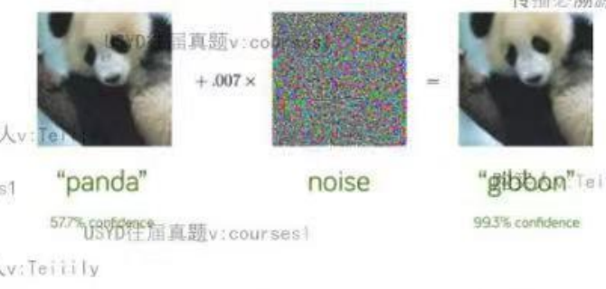
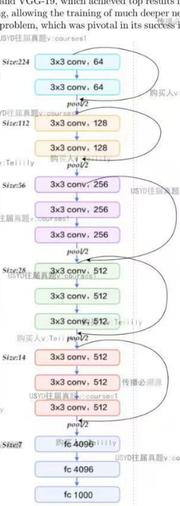
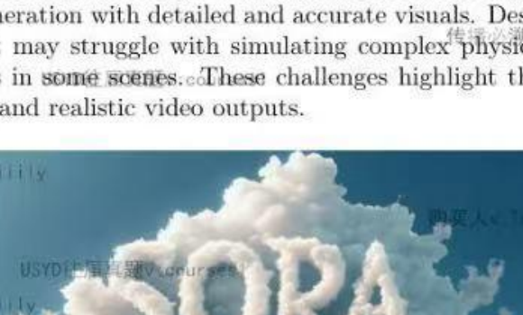

# COMP5329 Deep Learning — 购买试卷

> Cleaned version: questions only.  
> 配图：`assets/` · Word 原件：`COMP5329_exam_questions_clean.docx`

---

## Multiple Choice Questions


**1.** What is an epoch in deep learning?

- (a) A measure of the model's accuracy on the training data.
- (b) One complete pass through the entire training dataset.
- (c) The number of layers in a neural network.
- (d) A type of optimization algorithm.

**2.** Given three matrices A, B, and C of dimensions m x n, n x p, and p x q respectively, which of the following represents the computational efficiency for the matrix multiplication (A x B) x C?

- (a) O(mnp)
- (b) O(npq)
- (c) O(mpq)
- (d) O(mnq)

**3.** How to calculate the size of a feature map after applying a convolutional layer followed by a pooling layer and then another convolutional layer?

- (a) Calculate the size after each layer sequentially, starting with the initial input.
- (b) Double the size after each convolutional layer.
- (c) Halve the size after each pooling layer.
- (d) The size remains the same after each layer.

**4.** In Generative Adversarial Networks (GANs), when the discriminator is very strong and the training is sufficient, what is the expected output of the discriminator at a certain point?

- (a) 0
- (b) 0.5
- (c) 1
- (d) ∞

**5.** Which of the following statements about Batch Normalization (BN) is correct?

- (a) Batch Normalization can be used at the input layer.
- (b) Batch Normalization eliminates the need for dropout.
- (c) Batch Normalization decreases the model's overall complexity.
- (d) Batch Normalization is only applicable to fully connected layers.

**6.** Given an image of size 256 x 256, what is the output size after applying three layers: one convolutional layer, one pooling layer, and then another convolutional layer? Assume all convolutional layers have a stride of 1 and padding that maintains the spatial dimensions, and the pooling layer has a stride of 2.

- (a) 256 x 256
- (b) 128 x 128
- (c) 64 x 64
- (d) 32 x 32

**7.** Which of the following statements about Long Short-Term Memory (LSTM) networks is correct?

- (a) LSTMs can only process sequences of fixed length.
- (b) LSTMs are designed to remember long-term dependencies in sequence data.
- (c) LSTMs do not have an internal memory state.
- (d) LSTMs are always faster than traditional RNNs.

---

## Short Answer / Coding Questions


### Question 1 — Backpropagation

Given the following neural network with two input neurons X1 and X2, two hidden neurons Y1 and Y2, and one output neuron Z. The weights of the connections are W1, W2, W3, W4, W5, and W6. The relationship between the neurons and weights is defined as:

$$Z = W_1 \cdot Y_1 + W_2 \cdot Y_2$$

and we need to minimize the loss function:

$$L = \|Z - t\|^2$$

where t is the target output.



1. Derive the expression for the gradient of the loss function with respect to the weight W5.

2. Describe the backpropagation steps required to update the weight W5.


### Question 2 — Adversarial Attacks

A photograph of a panda initially has a 57.7% confidence score for being classified as a panda by a deep learning model. However, after adding a layer of noise that is imperceptible to the human eye, the model misclassifies it with 99.3% confidence as a gibbon.



1. Why would this happen as the confidence score increases? Describe two methods to defend against such adversarial attacks. For each method, discuss its advantages and disadvantages.

2. There are various techniques that can be employed to make predictions in the context of adversarial attacks. Identify two methods that can be used for making predictions in adversarial settings. For each method, discuss its strengths and weaknesses.


### Question 3 — CNNs and Vision Transformers

Deep learning models have evolved significantly, with architectures like Convolutional Neural Networks (CNNs) and Vision Transformers (ViTs) being at the forefront of computer vision tasks. CNNs leverage convolutional layers to extract local features through shared weights, while ViTs utilize self-attention mechanisms to capture both local and global dependencies. Understanding the fundamental differences between these two architectures and how they process information is crucial for advancing in the field.

Additionally, there is ongoing research into whether traditional CNNs can be adapted to learn global features akin to those captured by attention mechanisms in transformers. One proposed method involves increasing the filter size in CNNs significantly.

1. Fundamentally, what are the differences between the self-attention layers in Vision Transformers (ViTs) and the convolutional layers in Convolutional Neural Networks (CNNs)? How do these differences affect the way each model processes information?

2. Consider a VGG-like network where the filter size is changed from 3 x 3 to 21 x 21, or another similarly larger size. Can this adjustment mimic the attention mechanism to learn global features? Discuss the potential effectiveness and limitations of this approach.


### Question 4 — LSTM Regularization and Gradients

1. What are some common methods to regularize LSTM networks? Discuss the advantages and disadvantages of each method.

2. Explain why LSTMs are able to avoid the problem of gradient explosion more effectively than traditional RNNs.


### Question 5 — GCNs, CNNs, and Transformers

1. Compare and contrast the application of Graph Convolutional Networks (GCNs) and Convolutional Neural Networks (CNNs) in image recognition tasks. Discuss the fundamental differences in how each network processes image data. In what situations might GCNs provide an advantage over CNNs for image recognition? Consider examples where the relationships between pixels or image regions are better represented as a graph.

2. Compare and contrast Convolutional Neural Networks (CNNs) and Transformers. Discuss their primary purposes, fundamental components, and typical applications in the context of computer vision and other fields.


### Question 6 — Overfitting and Dropout

1. What are some techniques to mitigate overfitting in machine learning models? For each strategy, provide a brief explanation of how it works and discuss its advantages and disadvantages as discussed in the Week 4 lecture.

2. How does dropout improve the robustness of a neural network model? Discuss the mechanisms through which dropout enhances the model’s ability to generalize to new, unseen data.


### Question 7 — VGG / ResNet / PyTorch

VGG (Visual Geometry Group) and ResNet (Residual Networks) are prominent CNN architectures used in image classification tasks. VGG is characterized by its simplicity, employing small 3 x 3 filters across deep networks, exemplified by VGG-16 and VGG-19, which achieved top results in the ILSVRC 2014 competition. ResNet introduced residual learning, allowing the training of much deeper networks by using skip connections to mitigate the vanishing gradient problem, which was pivotal in its success in the ILSVRC 2015 competition.



1. Implement the above block as a subclass of PyTorch nn.Module.

```python
class VGG(nn.Module):    def __init__(self, in_channels):        # Your code here.    def forward(self, x):        # Your code here.
```

2. Implement the code to perform any data preprocessing or data augmentations in torchvision.transforms and encapsulate the process as an instance of transforms.Compose. You need to resize the image into the shape 224 x 224, randomly flip the images horizontally, and scale the RGB values into the range [0, 1].

```python
transforms = transforms.Compose([...])dataset = torchvision.datasets.ImageNet('path', transform=transforms)data_loader = ...
```

3. Implement the code to train the dataset for 100 epochs. Validate the model every 5th epoch and print the validation accuracy to the standard output. Perform early stopping when overfitting is detected. Save the model to the current working directory as a file named inception.pth every 10th epoch.


### Question 8 — Sora / Text-to-Video Models

OpenAI’s Sora is a cutting-edge text-to-video model capable of generating high-definition videos from textual descriptions. Released in February 2024, Sora uses advanced diffusion techniques to convert text prompts into videos that can be up to one minute long. It is built on the technology behind OpenAI’s DALL-E 3, allowing for complex scene generation with detailed and accurate visuals. Despite its impressive capabilities, Sora has some limitations. It may struggle with simulating complex physical interactions and accurately depicting spatial relationships in some scenes. These challenges highlight the ongoing need for refinement and testing to ensure reliable and realistic video outputs.



1. Discuss the types of video data needed, including both AI-generated videos from Sora and human-generated videos.

2. Describe how you would process and preprocess the video data, such as frame extraction, resizing, normalization, and possibly converting video data to feature vectors or embeddings.

3. Sora is using diffusion models to generate frame-by-frame pictures. Discuss why OpenAI is not using GAN models in text-to-video tasks.

4. Sora does not support generating audio in video right now. How would you change the model architecture to support video with audio in future?

5. Identify and analyze the limitations of Sora in accurately depicting spatial relationships and complex physical interactions. How might these limitations impact its effectiveness in certain applications?

