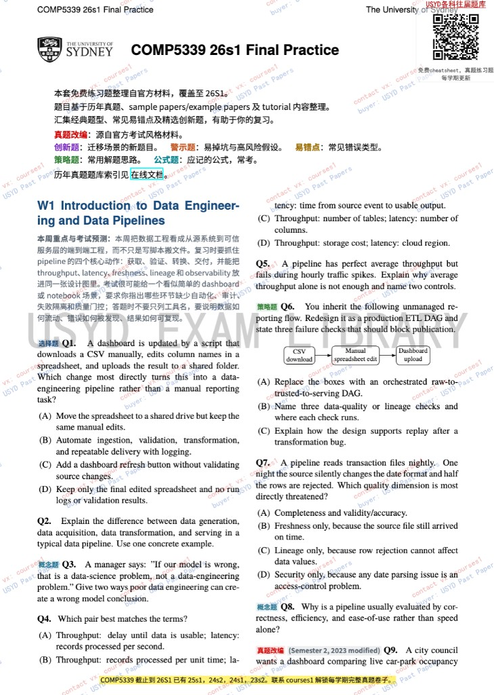
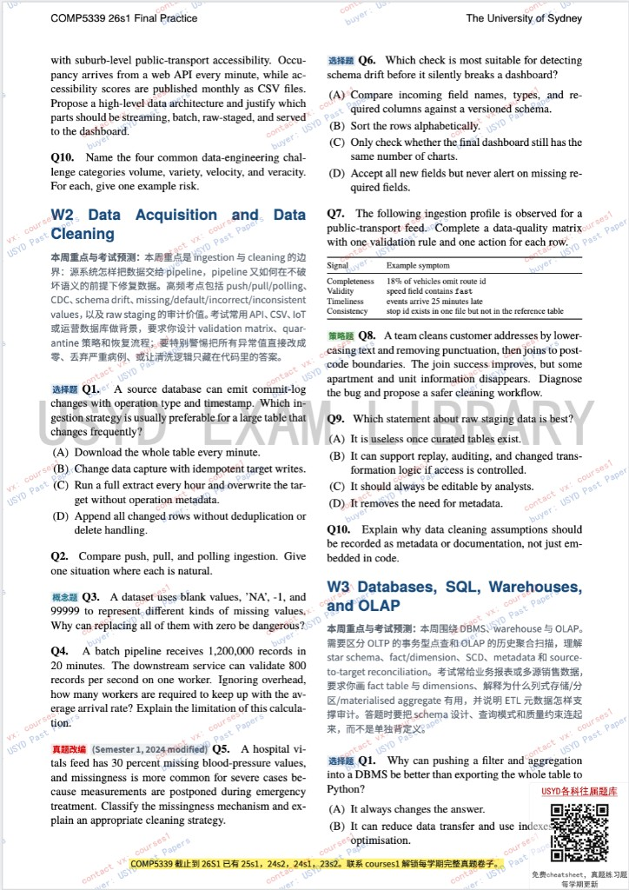
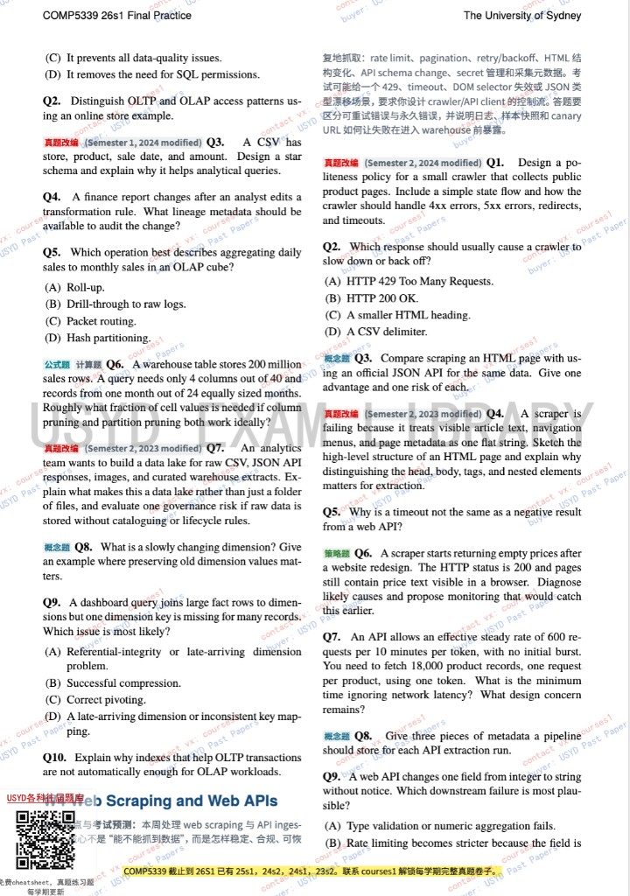
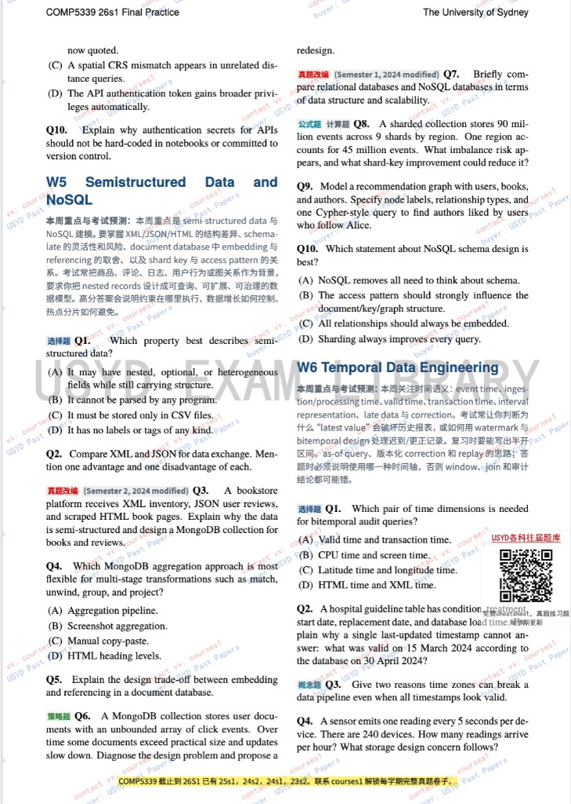
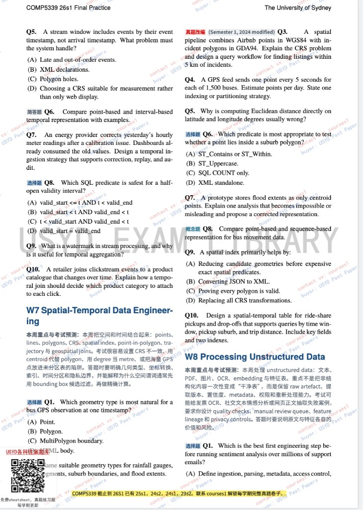
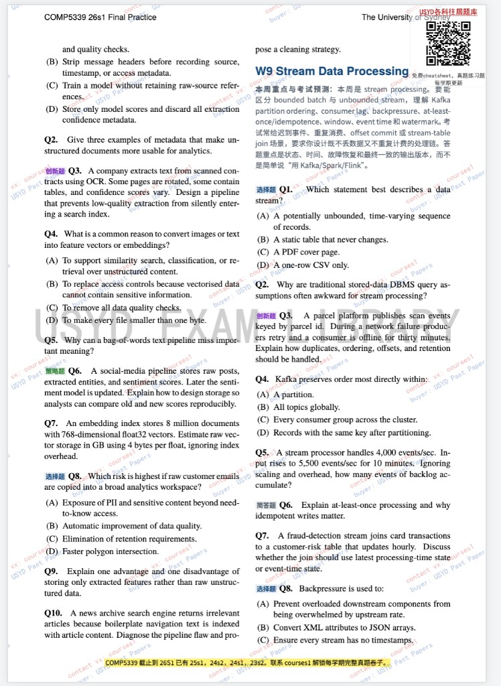
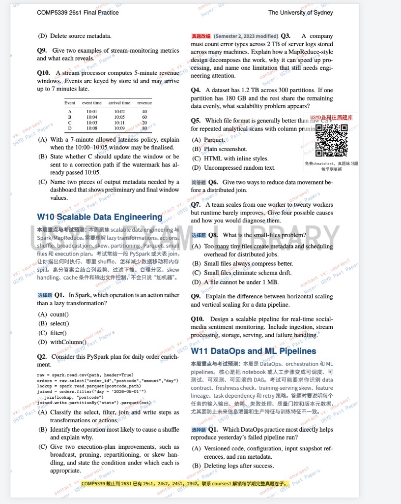
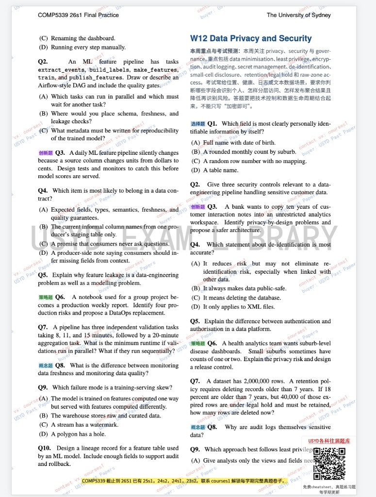
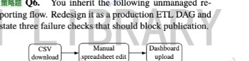
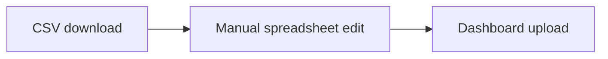

# COMP5339 — 26s1 Final Practice (W1–W12)

> **来源**：外部练习资料（截至 26S1）  
> **格式**：参照 [`Quiz2 模拟题.md`](../Quiz2%20模拟题.md)  
> **说明**：题目无官方答案；含图片/表格的题已附原图

**原始扫描页：**

| 页 | 内容 |
|----|------|
| [Page 1 — W1](images/page-01-w1.png) | Week 1 Introduction + Q1–Q9 |
| [Page 2 — W2/W3](images/page-02-w2-w3.png) | Q9 续 + W2 全题 + W3 Q1 |
| [Page 3 — W3/W4](images/page-03-w3-w4.png) | W3 Q2–Q10 + W4 Web Scraping & APIs |
| [Page 4 — W5/W6](images/page-04-w5-w6.png) | W5 NoSQL + W6 Temporal（Q1–Q4） |
| [Page 5 — W6/W7/W8](images/page-05-w6-w8.png) | W6 Q5–Q10 + W7 Spatial + W8 Q1 |
| [Page 6 — W8/W9](images/page-06-w8-w9.png) | W8 Q2–Q10 + W9 Q1–Q8 |
| [Page 7 — W9/W10/W11](images/page-07-w9-w11.png) | W9 Q9–Q10 + W10 全题 + W11 Q1 |
| [Page 8 — W11/W12](images/page-08-w11-w12.png) | W11 Q2–Q10 + W12 Q1–Q9 |
| [Page 9 — W12](images/page-09-w12-q10.png) | W12 Q9 续 + Q10 |


















---

## W1 — Introduction to Data Engineering and Data Pipelines

> **本周重点**：数据工程是端到端服务，不是"搬文件"。核心动作：ingest（获取）→ validate（验证）→ transform（转换）→ deliver（交付）。常考指标：throughput、latency、freshness、lineage、observability。

---

### Q1 · 选择题

A dashboard is updated by a script that downloads a CSV manually, edits column names in a spreadsheet, and uploads the result to a shared folder. Which change most directly turns this into a data-engineering pipeline rather than a manual reporting task?

- [ ] (A) Move the spreadsheet to a shared drive but keep the same manual edits.
- [ ] (B) Automate ingestion, validation, transformation, and repeatable delivery with logging.
- [ ] (C) Add a dashboard refresh button without validating source changes.
- [ ] (D) Keep only the final edited spreadsheet and no run logs or validation results.

---

### Q2

Explain the difference between **data generation**, **data acquisition**, **data transformation**, and **serving** in a typical data pipeline. Use one concrete example.

---

### Q3 · 概念题

A manager says: *"If our model is wrong, that is a data-science problem, not a data-engineering problem."* Give two ways poor data engineering can create a wrong model conclusion.

---

### Q4 · 选择题

Which pair best matches the terms?

- [ ] (A) Throughput: delay until data is usable; latency: records processed per second.
- [ ] (B) Throughput: records processed per unit time; latency: time from source event to usable output.
- [ ] (C) Throughput: number of tables; latency: number of columns.
- [ ] (D) Throughput: storage cost; latency: cloud region.

---

### Q5

A pipeline has perfect average throughput but fails during hourly traffic spikes. Explain why average throughput alone is not enough and name two controls.

---

### Q6 · 策略题

You inherit the following unmanaged reporting flow. Redesign it as a production ETL DAG and state three failure checks that should block publication.

**Given flow（原题配图）：**



**Diagram（Mermaid 重绘）：**



1. **(A)** Replace the boxes with an orchestrated raw → trusted → serving DAG.
2. **(B)** Name three data-quality or lineage checks and where each check runs.
3. **(C)** Explain how the design supports replay after a transformation bug.

---

### Q7 · 选择题

A pipeline reads transaction files nightly. One night the source silently changes the date format and half the rows are rejected. Which quality dimension is most directly threatened?

- [ ] (A) Completeness and validity/accuracy.
- [ ] (B) Freshness only, because the source file still arrived on time.
- [ ] (C) Lineage only, because row rejection cannot affect data values.
- [ ] (D) Security only, because any date parsing issue is an access-control problem.

---

### Q8 · 概念题

Why is a pipeline usually evaluated by **correctness**, **efficiency**, and **ease-of-use** rather than speed alone?

---

### Q9 · 真题改编（Semester 2, 2023 modified）

A city council wants a dashboard comparing live car-park occupancy with suburb-level public-transport accessibility. Occupancy arrives from a web API every minute, while accessibility scores are published monthly as CSV files.

Propose a high-level data architecture and justify which parts should be **streaming**, **batch**, **raw-staged**, and **served** to the dashboard.

---

### Q10

Name the four common data-engineering challenge categories **volume**, **variety**, **velocity**, and **veracity**. For each, give one example risk.

---

## W2 — Data Acquisition and Data Cleaning

> **本周重点**：ingestion 与 cleaning 的边界——源系统怎样把数据交给 pipeline，pipeline 又如何在不破坏语义的前提下修复数据。高频考点：push/pull/polling、CDC、schema drift、missing/default/incorrect/inconsistent values、raw staging 的审计价值。考试常要求设计 validation matrix、quarantine 策略和恢复流程；警惕把所有异常值直接填零、丢弃严重病例、或让清洗逻辑只藏在代码里。

---

### Q1 · 选择题

A source database can emit commit-log changes with operation type and timestamp. Which ingestion strategy is usually preferable for a large table that changes frequently?

- [ ] (A) Download the whole table every minute.
- [ ] (B) Change data capture with idempotent target writes.
- [ ] (C) Run a full extract every hour and overwrite the target without operation metadata.
- [ ] (D) Append all changed rows without deduplication or delete handling.

---

### Q2

Compare **push**, **pull**, and **polling** ingestion. Give one situation where each is natural.

---

### Q3 · 概念题

A dataset uses blank values, `'NA'`, `-1`, and `99999` to represent different kinds of missing values. Why can replacing all of them with zero be dangerous?

---

### Q4 · 公式题

A batch pipeline receives **1,200,000 records in 20 minutes**. The downstream service can validate **800 records per second** on one worker. Ignoring overhead, how many workers are required to keep up with the average arrival rate? Explain the limitation of this calculation.

---

### Q5 · 真题改编（Semester 1, 2024 modified）

A hospital vitals feed has 30% missing blood-pressure values, and missingness is more common for severe cases because measurements are postponed during emergency treatment.

Classify the missingness mechanism and explain an appropriate cleaning strategy.

---

### Q6 · 选择题

Which check is most suitable for detecting **schema drift** before it silently breaks a dashboard?

- [ ] (A) Compare incoming field names, types, and required columns against a versioned schema.
- [ ] (B) Sort the rows alphabetically.
- [ ] (C) Only check whether the final dashboard still has the same number of charts.
- [ ] (D) Accept all new fields but never alert on missing required fields.

---

### Q7

The following ingestion profile is observed for a public-transport feed. Complete a **data-quality matrix** with one validation rule and one action for each row.

| Signal | Example symptom |
|--------|-----------------|
| Completeness | 18% of vehicles omit route id |
| Validity | speed field contains `fast` |
| Timeliness | events arrive 25 minutes late |
| Consistency | stop id exists in one file but not in the reference table |

---

### Q8 · 策略题

A team cleans customer addresses by lowercasing text and removing punctuation, then joins to postcode boundaries. The join success improves, but some apartment and unit information disappears.

Diagnose the bug and propose a safer cleaning workflow.

---

### Q9 · 选择题

Which statement about **raw staging data** is best?

- [ ] (A) It is useless once curated tables exist.
- [ ] (B) It can support replay, auditing, and changed transformation logic if access is controlled.
- [ ] (C) It should always be editable by analysts.
- [ ] (D) It removes the need for metadata.

---

### Q10

Explain why data cleaning assumptions should be recorded as **metadata or documentation**, not just embedded in code.

---

## W3 — Databases, SQL, Warehouses, and OLAP

> **本周重点**：DBMS、warehouse 与 OLAP。区分 OLTP 事务型点查 vs OLAP 历史聚合扫描；理解 star schema、fact/dimension、SCD、metadata、source-to-target reconciliation。考试常要求画 fact table 与 dimensions、解释列式存储/分区/materialised aggregate，并说明 ETL 元数据如何支撑审计。


---

### Q1 · 选择题

Why can pushing a filter and aggregation into a DBMS be better than exporting the whole table to Python?

- [ ] (A) It always changes the answer.
- [ ] (B) It can reduce data transfer and use indexes/optimisation.
- [ ] (C) It prevents all data-quality issues.
- [ ] (D) It removes the need for SQL permissions.

---

### Q2

Distinguish **OLTP** and **OLAP** access patterns using an online store example.

---

### Q3 · 真题改编（Semester 1, 2024 modified）

A CSV has store, product, sale date, and amount. Design a **star schema** and explain why it helps analytical queries.

---

### Q4

A finance report changes after an analyst edits a transformation rule. What **lineage metadata** should be available to audit the change?

---

### Q5 · 选择题

Which operation best describes aggregating daily sales to monthly sales in an OLAP cube?

- [ ] (A) Roll-up.
- [ ] (B) Drill-through to raw logs.
- [ ] (C) Packet routing.
- [ ] (D) Hash partitioning.

---

### Q6 · 公式题 / 计算题

A warehouse table stores **200 million** sales rows. A query needs only **4 columns out of 40** and records from **one month out of 24** equally sized months. Roughly what **fraction of cell values** is needed if column pruning and partition pruning both work ideally?

---

### Q7 · 真题改编（Semester 2, 2023 modified）

An analytics team wants to build a **data lake** for raw CSV, JSON API responses, images, and curated warehouse extracts. Explain what makes this a data lake rather than just a folder of files, and evaluate one **governance risk** if raw data is stored without cataloguing or lifecycle rules.

---

### Q8 · 概念题

What is a **slowly changing dimension**? Give an example where preserving old dimension values matters.

---

### Q9 · 选择题

A dashboard query joins large fact rows to dimensions but one dimension key is missing for many records. Which issue is most likely?

- [ ] (A) Referential-integrity or late-arriving dimension problem.
- [ ] (B) Successful compression.
- [ ] (C) Correct pivoting.
- [ ] (D) A late-arriving dimension or inconsistent key mapping.

---

### Q10

Explain why indexes that help **OLTP** transactions are not automatically enough for **OLAP** workloads.

---

## W4 — Web Scraping and Web APIs

> **本周重点**：web scraping 与 API ingestion。核心不是"能不能抓到数据"，而是怎样**稳定、合规、可恢复**地抓取。常考 rate limit、pagination、retry/backoff、HTML 结构变化、API schema change、secret 管理和采集元数据。考试可能给 429、timeout、DOM selector 失效或 JSON 类型漂移场景，要求设计 crawler/API client 控制流；区分可重试错误与永久错误，说明日志、样本快照和 canary URL 如何让失败在进入 warehouse 前暴露。

---

### Q1 · 真题改编（Semester 2, 2024 modified）

Design a **politeness policy** for a small crawler that collects public product pages. Include a simple state flow and how the crawler should handle **4xx errors**, **5xx errors**, **redirects**, and **timeouts**.

---

### Q2 · 选择题

Which response should usually cause a crawler to **slow down or back off**?

- [ ] (A) HTTP 429 Too Many Requests.
- [ ] (B) HTTP 200 OK.
- [ ] (C) A smaller HTML heading.
- [ ] (D) A CSV delimiter.

---

### Q3 · 概念题

Compare scraping an HTML page with using an official **JSON API** for the same data. Give one advantage and one risk of each.

---

### Q4 · 真题改编（Semester 2, 2023 modified）

A scraper is failing because it treats visible article text, navigation menus, and page metadata as one flat string. Sketch the **high-level structure of an HTML page** and explain why distinguishing the head, body, tags, and nested elements matters for extraction.

---

### Q5

Why is a **timeout** not the same as a negative result from a web API?

---

### Q6 · 策略题

A scraper starts returning **empty prices** after a website redesign. The HTTP status is **200** and pages still contain price text visible in a browser. Diagnose likely causes and propose **monitoring** that would catch this earlier.

---

### Q7 · 公式题

An API allows an effective steady rate of **600 requests per 10 minutes** per token, with no initial burst. You need to fetch **18,000 product records**, one request per product, using one token. What is the **minimum time** ignoring network latency? What **design concern** remains?

---

### Q8 · 概念题

Give three pieces of **metadata** a pipeline should store for each API extraction run.

---

### Q9 · 选择题

A web API changes one field from **integer to string** without notice. Which downstream failure is most plausible?

- [ ] (A) Type validation or numeric aggregation fails.
- [ ] (B) Rate limiting becomes stricter because the field is now textual.
- [ ] (C) A spatial CRS mismatch appears in unrelated distance queries.
- [ ] (D) The API authentication token gains broader privileges automatically.

---

### Q10

Explain why **authentication secrets** for APIs should not be hard-coded in notebooks or committed to version control.

---

## W5 — Semistructured Data and NoSQL

> **本周重点**：半结构化数据与 NoSQL 建模。理解 XML/JSON/HTML 结构差异、schema-late 的灵活性与风险、document DB 的 embedding vs referencing 取舍、shard key 与 access pattern 的匹配。高分答案要说明约束在哪里 enforced、如何控制文档膨胀、如何避免 hot shard。


---

### Q1 · 选择题

Which property best describes **semi-structured data**?

- [ ] (A) It may have nested, optional, or heterogeneous fields while still carrying structure.
- [ ] (B) It cannot be parsed by any program.
- [ ] (C) It must be stored only in CSV files.
- [ ] (D) It has no labels or tags of any kind.

---

### Q2

Compare **XML** and **JSON** for data exchange. Mention one advantage and one disadvantage of each.

---

### Q3 · 真题改编（Semester 2, 2024 modified）

A bookstore platform receives XML inventory, JSON user reviews, and scraped HTML book pages. Explain why the data is semi-structured and design a **MongoDB collection** for books and reviews.

---

### Q4 · 选择题

Which MongoDB aggregation approach is most flexible for multi-stage transformations such as match, unwind, group, and project?

- [ ] (A) Aggregation pipeline.
- [ ] (B) Screenshot aggregation.
- [ ] (C) Manual copy-paste.
- [ ] (D) HTML heading levels.

---

### Q5

Explain the design trade-off between **embedding** and **referencing** in a document database.

---

### Q6 · 策略题

A MongoDB collection stores user documents with an **unbounded array of click events**. Over time some documents exceed practical size and updates slow down. Diagnose the design problem and propose a redesign.

---

### Q7 · 真题改编（Semester 1, 2024 modified）

Briefly compare **relational databases** and **NoSQL databases** in terms of data structure and scalability.

---

### Q8 · 公式题 / 计算题

A sharded collection stores **90 million events** across **9 shards** by region. One region accounts for **45 million events**. What **imbalance risk** appears, and what **shard-key improvement** could reduce it?

---

### Q9

Model a **recommendation graph** with users, books, and authors. Specify node labels, relationship types, and one **Cypher-style query** to find authors liked by users who follow Alice.

---

### Q10 · 选择题

Which statement about NoSQL schema design is best?

- [ ] (A) NoSQL removes all need to think about schema.
- [ ] (B) The access pattern should strongly influence the document/key/graph structure.
- [ ] (C) All relationships should always be embedded.
- [ ] (D) Sharding always improves every query.

---

## W6 — Temporal Data Engineering

> **本周重点**：时间语义——event time、ingestion/processing time、valid time、transaction time；interval 表示、late data 与 correction、watermark、bitemporal 设计、as-of 查询。考试常给医疗/能源/零售场景，要求说明为何单个 `updated_at` 不够、如何用 half-open interval 表达 validity、late event 怎样进入 window。


---

### Q1 · 选择题

Which pair of time dimensions is needed for **bitemporal audit queries**?

- [ ] (A) Valid time and transaction time.
- [ ] (B) CPU time and screen time.
- [ ] (C) Latitude time and longitude time.
- [ ] (D) HTML time and XML time.

---

### Q2

A hospital guideline table has condition, treatment, start date, replacement date, and database load time. Explain why a single **last-updated timestamp** cannot answer: *what was valid on 15 March 2024 according to the database on 30 April 2024?*

---

### Q3 · 概念题

Give two reasons **time zones** can break a data pipeline even when all timestamps look valid.

---

### Q4 · 公式题 / 计算题

A sensor emits one reading every **5 seconds** per device. There are **240 devices**. How many readings arrive per **hour**? What **storage design concern** follows?

---

### Q5 · 选择题

A stream window includes events by their **event timestamp**, not arrival timestamp. What problem must the system handle?

- [ ] (A) Late and out-of-order events.
- [ ] (B) XML declarations.
- [ ] (C) Polygon holes.
- [ ] (D) Choosing a CRS suitable for measurement rather than only web display.

---

### Q6

Compare **point-based** and **interval-based** temporal representation with examples.

---

### Q7

An energy provider corrects yesterday's hourly meter readings after a calibration issue. Dashboards already consumed the old values. Design a **temporal ingestion strategy** that supports correction, replay, and audit.

---

### Q8 · 选择题

Which SQL predicate is safest for a **half-open validity interval**?

- [ ] (A) `valid_start <= t AND t < valid_end`
- [ ] (B) `valid_start < t AND valid_end < t`
- [ ] (C) `t < valid_start AND valid_end < t`
- [ ] (D) `valid_start = valid_end`

---

### Q9

What is a **watermark** in stream processing, and why is it useful for temporal aggregation?

---

### Q10

A retailer joins clickstream events to a product catalogue that changes over time. Explain how a **temporal join** should decide which product category to attach to each click.

---

## W7 — Spatial-Temporal Data Engineering

> **本周重点**：空间与时间结合——point/line/polygon、CRS、spatial index、point-in-polygon、trajectory、geospatial join。常见陷阱：CRS 不一致、把 polygon 当 centroid、未做 bounding-box 预过滤就全量精确计算。答题要把 geometry 类型、索引策略和查询 workflow 连起来。

---

### Q1 · 选择题

Which geometry type is most natural for a **bus GPS observation** at one timestamp?

- [ ] (A) Point.
- [ ] (B) Polygon.
- [ ] (C) MultiPolygon boundary.
- [ ] (D) XML body.

---

### Q2

Name suitable **geometry types** for rainfall gauges, road segments, suburb boundaries, and flood extents.

---

### Q3 · 真题改编（Semester 1, 2024 modified）

A spatial pipeline combines Airbnb points in **WGS84** with incident polygons in **GDA94**. Explain the **CRS problem** and design a query workflow for finding listings within **5 km** of incidents.

---

### Q4 · 公式题

A GPS feed sends one point every **5 seconds** for each of **1,500 buses**. Estimate **points per day**. State one **indexing or partitioning** strategy.

---

### Q5

Why is computing **Euclidean distance directly on latitude and longitude degrees** usually wrong?

---

### Q6 · 选择题

Which predicate is most appropriate to test whether a point lies **inside a suburb polygon**?

- [ ] (A) `ST_Contains` or `ST_Within`.
- [ ] (B) `ST_Uppercase`.
- [ ] (C) SQL `COUNT` only.
- [ ] (D) XML standalone.

---

### Q7

A prototype stores flood extents as only **centroid points**. Explain one analysis that becomes impossible or misleading and propose a corrected representation.

---

### Q8 · 概念题

Compare **point-based** and **sequence-based** representation for bus movement data.

---

### Q9 · 选择题

A spatial index primarily helps by:

- [ ] (A) Reducing candidate geometries before expensive exact spatial predicates.
- [ ] (B) Converting JSON to XML.
- [ ] (C) Proving every polygon is valid.
- [ ] (D) Replacing all CRS transformations.

---

### Q10

Design a **spatial-temporal table** for ride-share pickups and drop-offs that supports queries by time window, pickup suburb, and trip distance. Include key fields and two indexes.

---

## W8 — Processing Unstructured Data

> **本周重点**：非结构化数据处理——text/PDF/image、OCR、embedding、metadata。强调保留 raw artifact、版本化、metadata、quality check 和 manual review queue；注意 privacy 与 access control。


---

### Q1 · 选择题

Which is the best first engineering step before running sentiment analysis over millions of support emails?

- [ ] (A) Define ingestion, parsing, metadata, access control, and privacy controls before model training.
- [ ] (B) Train the largest available model immediately on raw email bodies.
- [ ] (C) Delete all attachments and headers without documenting assumptions.
- [ ] (D) Copy every email into a shared folder with no retention policy.

---

### Q2

Give three examples of **metadata** that make unstructured documents more usable for analytics.

---

### Q3 · 创新题

A company extracts text from scanned contracts using **OCR**. Some pages are rotated, some contain tables, and confidence scores vary. Design a pipeline that prevents low-quality extraction from silently entering a search index.

---

### Q4 · 选择题

What is a common reason to convert images or text into **feature vectors or embeddings**?

- [ ] (A) To support similarity search, classification, or retrieval over unstructured content.
- [ ] (B) To replace access controls because vectorised data cannot contain sensitive information.
- [ ] (C) To remove all data quality checks.
- [ ] (D) To make every file smaller than one byte.

---

### Q5

Why can a **bag-of-words** text pipeline miss important meaning?

---

### Q6 · 策略题

A social-media pipeline stores raw posts, extracted entities, and sentiment scores. Later the sentiment model is updated. Explain how to design storage so analysts can compare old and new scores **reproducibly**.

---

### Q7 · 公式题

An embedding index stores **8 million documents** with **768-dimensional float32** vectors. Estimate raw vector storage in **GB** using 4 bytes per float, ignoring index overhead.

---

### Q8 · 选择题

Which risk is highest if raw customer emails are copied into a broad analytics workspace?

- [ ] (A) Exposure of PII and sensitive content beyond need-to-know access.
- [ ] (B) Automatic improvement of data quality.
- [ ] (C) Elimination of retention requirements.
- [ ] (D) Faster polygon intersection.

---

### Q9

Explain one advantage and one disadvantage of storing only **extracted features** rather than raw unstructured data.

---

### Q10

A news archive search engine returns irrelevant articles because **boilerplate navigation text** is indexed with article content. Diagnose the pipeline flaw and propose a cleaning strategy.

---

## W9 — Stream Data Processing

> **本周重点**：stream processing——bounded batch vs unbounded stream、Kafka partition ordering、consumer lag、backpressure、at-least-once/idempotence、window、event time、watermark。考试常给 late events、duplicate consumption、offset commit、stream-table join 场景，要求设计既不丢数也不 double-billing 的处理链。答题重点在 state、time、fault recovery 和最终一致输出，而非只写 "用 Kafka/Spark/Flink"。


---

### Q1 · 选择题

Which statement best describes a **data stream**?

- [ ] (A) A potentially unbounded, time-varying sequence of records.
- [ ] (B) A static table that never changes.
- [ ] (C) A PDF cover page.
- [ ] (D) A one-row CSV only.

---

### Q2

Why are traditional **stored-data DBMS** query assumptions often awkward for stream processing?

---

### Q3 · 创新题

A parcel platform publishes scan events keyed by parcel id. During a network failure producers retry and a consumer is offline for **thirty minutes**. Explain how **duplicates**, **ordering**, **offsets**, and **retention** should be handled.

---

### Q4 · 选择题

Kafka preserves order most directly within:

- [ ] (A) A partition.
- [ ] (B) All topics globally.
- [ ] (C) Every consumer group across the cluster.
- [ ] (D) Records with the same key after partitioning.

---

### Q5 · 公式题

A stream processor handles **4,000 events/sec**. Input rises to **5,500 events/sec** for **10 minutes**. Ignoring scaling and overhead, how many events of **backlog** accumulate?

---

### Q6 · 简答题

Explain **at-least-once** processing and why **idempotent writes** matter.

---

### Q7

A fraud-detection stream joins card transactions to a customer-risk table that updates hourly. Discuss whether the join should use latest **processing-time state** or **event-time state**.

---

### Q8 · 选择题

Backpressure is used to:

- [ ] (A) Prevent overloaded downstream components from being overwhelmed by upstream rate.
- [ ] (B) Convert XML attributes to JSON arrays.
- [ ] (C) Ensure every stream has no timestamps.
- [ ] (D) Delete source metadata.

---

### Q9

Give two examples of **stream-monitoring metrics** and what each reveals.

---

### Q10

A stream processor computes **5-minute revenue windows**. Events are keyed by store id and may arrive up to **7 minutes late**.

| Event | event time | arrival time | revenue |
|-------|------------|--------------|---------|
| A | 10:01 | 10:02 | 40 |
| B | 10:04 | 10:05 | 60 |
| C | 10:03 | 10:11 | 20 |
| D | 10:08 | 10:09 | 80 |

1. **(A)** With a 7-minute allowed lateness policy, explain when the **10:00–10:05** window may be finalised.
2. **(B)** State whether **C** should update the window or be sent to a correction path if the watermark has already passed 10:05.
3. **(C)** Name two pieces of output metadata needed by a dashboard that shows preliminary and final window values.

---

## W10 — Scalable Data Engineering

> **本周重点**：scalable data engineering——Spark/MapReduce、lazy transformation vs action、shuffle、join 类型、partitioning、Parquet、small files、execution plan。考试常给 PySpark 代码或 skew 场景，要求指出哪步触发 shuffle、如何 broadcast/prune/repartition，以及 scale-out 后为何加速不明显。

---

### Q1 · 选择题

In Spark, which operation is an **action** rather than a lazy transformation?

- [ ] (A) `count()`
- [ ] (B) `select()`
- [ ] (C) `filter()`
- [ ] (D) `withColumn()`

---

### Q2

Consider this PySpark plan for daily order enrichment:

```python
raw = spark.read.csv(path, header=True)
orders = raw.select("order_id", "postcode", "amount", "day")
lookup = spark.read.parquet(postcode_path)
joined = orders.filter("day = '2026-05-01'")
joined = joined.join(lookup, "postcode")
joined.write.partitionBy("state").parquet(out)
```

1. **(A)** Classify the `select`, `filter`, `join`, and `write` steps as **transformations** or **actions**.
2. **(B)** Identify the operation most likely to cause a **shuffle** and explain why.
3. **(C)** Give two execution-plan improvements (e.g., broadcast, pruning, repartitioning, or skew handling) and state the condition under which each is appropriate.

---

### Q3 · 真题改编（Semester 2, 2023 modified）

A company must count error types across **2 TB** of server logs stored across many machines. Explain how a **MapReduce-style** design decomposes the work, why it can speed up processing, and name one limitation that still needs engineering attention.

---

### Q4 · 公式题

A dataset has **1.2 TB** across **300 partitions**. If one partition has **180 GB** and the rest share the remaining data evenly, what **scalability problem** appears?

---

### Q5 · 选择题

Which file format is generally better than raw CSV for repeated analytical scans with **column pruning**?

- [ ] (A) Parquet.
- [ ] (B) Plain screenshot.
- [ ] (C) HTML with inline styles.
- [ ] (D) Uncompressed random text.

---

### Q6 · 简答题

Give two ways to reduce **data movement** before a distributed join.

---

### Q7

A team scales from **one worker to twenty workers** but runtime barely improves. Give **four possible causes** and how you would diagnose them.

---

### Q8 · 选择题

What is the **small-files problem**?

- [ ] (A) Too many tiny files create metadata and scheduling overhead for distributed jobs.
- [ ] (B) Small files always compress better.
- [ ] (C) Small files eliminate schema drift.
- [ ] (D) A file cannot be under 1 MB.

---

### Q9

Explain the difference between **horizontal scaling** and **vertical scaling** for a data pipeline.

---

### Q10

Design a **scalable pipeline** for real-time social-media sentiment monitoring. Include ingestion, stream processing, storage, serving, and failure handling.

---

## W11 — DataOps and ML Pipelines

> **本周重点**：DataOps、orchestration、ML pipeline——把 notebook 变成可运维 DAG、data contract、freshness check、training-serving skew、feature lineage。考试常给 feature pipeline 或 notebook 上生产场景，要求画 DAG、放 quality gate、说明 reproducibility metadata。


---

### Q1 · 选择题

Which DataOps practice most directly helps **reproduce yesterday's failed pipeline run**?

- [ ] (A) Versioned code, configuration, input snapshot references, and run metadata.
- [ ] (B) Deleting logs after success.
- [ ] (C) Renaming the dashboard.
- [ ] (D) Running every step manually.

---

### Q2

An ML feature pipeline has tasks `extract_events`, `build_labels`, `make_features`, `train`, and `publish_features`. Draw or describe an **Airflow-style DAG** and include the quality gates.

1. **(A)** Which tasks can run in **parallel** and which must wait for another task?
2. **(B)** Where would you place **schema**, **freshness**, and **leakage** checks?
3. **(C)** What **metadata** must be written for reproducibility of the trained model?

---

### Q3 · 创新题

A daily ML feature pipeline silently changes because a source column changes units from **dollars to cents**. Design **tests and monitors** to catch this before model scores are served.

---

### Q4 · 选择题

Which item is most likely to belong in a **data contract**?

- [ ] (A) Expected fields, types, semantics, freshness, and quality guarantees.
- [ ] (B) The current informal column names from one producer's staging table only.
- [ ] (C) A promise that consumers never ask questions.
- [ ] (D) A producer-side note saying consumers should infer missing fields from context.

---

### Q5

Explain why **feature leakage** is a data-engineering problem as well as a modelling problem.

---

### Q6 · 策略题

A notebook used for a group project becomes a **production weekly report**. Identify four production risks and propose a **DataOps replacement**.

---

### Q7 · 公式题

A pipeline has three independent validation tasks taking **8**, **11**, and **15 minutes**, followed by a **20-minute** aggregation task. What is the **minimum runtime** if validations run in parallel? What if they run sequentially?

---

### Q8 · 概念题

What is the difference between monitoring **data freshness** and monitoring **data quality**?

---

### Q9 · 选择题

Which failure mode is **training-serving skew**?

- [ ] (A) The model is trained on features computed one way but served with features computed differently.
- [ ] (B) The warehouse stores raw and curated data.
- [ ] (C) A stream has a watermark.
- [ ] (D) A polygon has a hole.

---

### Q10

Design a **lineage record** for a feature table used by an ML model. Include enough fields to support audit and rollback.

---

## W12 — Data Privacy and Security

> **本周重点**：privacy、security 与 governance——data minimisation、least privilege、encryption、audit logging、secret management、de-identification、small-cell disclosure、retention/legal hold、raw-zone access。考试常给位置/健康/日志/文本场景，要求判断哪些字段识别个人、怎样分层访问、怎样发布聚合结果且降低再识别风险。答题要把技术控制和数据生命周期结合起来，不能只写"加密即可"。


---

### Q1 · 选择题

Which field is most clearly **personally identifiable information** by itself?

- [ ] (A) Full name with date of birth.
- [ ] (B) A rounded monthly count by suburb.
- [ ] (C) A random row number with no mapping.
- [ ] (D) A table name.

---

### Q2

Give three **security controls** relevant to a data-engineering pipeline handling sensitive customer data.

---

### Q3 · 创新题

A bank wants to copy ten years of customer interaction notes into an **unrestricted analytics workspace**. Identify **privacy-by-design** problems and propose a safer architecture.

---

### Q4 · 选择题

Which statement about **de-identification** is most accurate?

- [ ] (A) It reduces risk but may not eliminate re-identification risk, especially when linked with other data.
- [ ] (B) It always makes data public-safe.
- [ ] (C) It means deleting the database.
- [ ] (D) It only applies to XML files.

---

### Q5

Explain the difference between **authentication** and **authorisation** in a data platform.

---

### Q6 · 策略题

A health analytics team wants **suburb-level disease dashboards**. Small suburbs sometimes have counts of one or two. Explain the **privacy risk** and design a **release control**.

---

### Q7 · 公式题

A dataset has **2,000,000 rows**. A retention policy requires deleting records older than **7 years**. If **18%** are older than 7 years, but **40,000** of those expired rows are under **legal hold** and must be retained, how many rows are **deleted now**?

---

### Q8 · 概念题

Why are **audit logs** themselves sensitive data?

---

### Q9 · 选择题

Which approach best follows **least privilege**?

- [ ] (A) Give analysts only the views and fields needed for their approved task.
- [ ] (B) Give everyone admin access because it is faster.
- [ ] (C) Grant warehouse-wide read access to all analysts for convenience.
- [ ] (D) Disable all logs.

---

### Q10

A data lake stores raw API responses containing **IP addresses** and **precise mobile locations**. Design a **governance policy** that balances analytics value with privacy and security.

---
