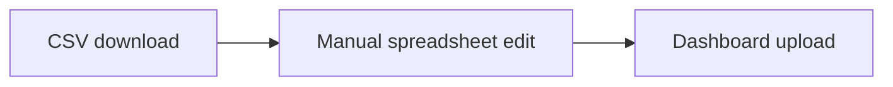

# COMP5339 — 26s1 Final Practice (W1–W3)

> **来源**：外部练习资料（截至 26S1）  
> **格式**：参照 [`Quiz2 模拟题.md`](../Quiz2%20模拟题.md)  
> **说明**：题目无官方答案；含图片的题已附原图或重绘 diagram

**原始扫描页：**

| 页 | 内容 |
|----|------|
| [Page 1 — W1](images/page-01-w1.png) | Week 1 Introduction + Q1–Q9 |
| [Page 2 — W2/W3](images/page-02-w2-w3.png) | Q9 续 + W2 全题 + W3 Q1 |

---

## W1 — Introduction to Data Engineering and Data Pipelines

> **本周重点**：数据工程是端到端服务，不是"搬文件"。核心动作：ingest（获取）→ validate（验证）→ transform（转换）→ deliver（交付）。常考指标：throughput、latency、freshness、lineage、observability。

---

### Q1 · 选择题

A dashboard is updated by a script that downloads a CSV manually, edits column names in a spreadsheet, and uploads the result to a shared folder. Which change most directly turns this into a data-engineering pipeline rather than a manual reporting task?

- [ ] (A) Move the spreadsheet to a shared drive but keep the same manual edits.
- [ ] (B) Automate ingestion, validation, transformation, and repeatable delivery with logging.
- [ ] (C) Add a dashboard refresh button without validating source changes.
- [ ] (D) Keep only the final edited spreadsheet and no run logs or validation results.

---

### Q2

Explain the difference between **data generation**, **data acquisition**, **data transformation**, and **serving** in a typical data pipeline. Use one concrete example.

---

### Q3 · 概念题

A manager says: *"If our model is wrong, that is a data-science problem, not a data-engineering problem."* Give two ways poor data engineering can create a wrong model conclusion.

---

### Q4 · 选择题

Which pair best matches the terms?

- [ ] (A) Throughput: delay until data is usable; latency: records processed per second.
- [ ] (B) Throughput: records processed per unit time; latency: time from source event to usable output.
- [ ] (C) Throughput: number of tables; latency: number of columns.
- [ ] (D) Throughput: storage cost; latency: cloud region.

---

### Q5

A pipeline has perfect average throughput but fails during hourly traffic spikes. Explain why average throughput alone is not enough and name two controls.

---

### Q6 · 策略题

You inherit the following unmanaged reporting flow. Redesign it as a production ETL DAG and state three failure checks that should block publication.

**Given flow（原题配图）：**

**Diagram（Mermaid 重绘）：**

1. **(A)** Replace the boxes with an orchestrated raw → trusted → serving DAG.
2. **(B)** Name three data-quality or lineage checks and where each check runs.
3. **(C)** Explain how the design supports replay after a transformation bug.

---

### Q7 · 选择题

A pipeline reads transaction files nightly. One night the source silently changes the date format and half the rows are rejected. Which quality dimension is most directly threatened?

- [ ] (A) Completeness and validity/accuracy.
- [ ] (B) Freshness only, because the source file still arrived on time.
- [ ] (C) Lineage only, because row rejection cannot affect data values.
- [ ] (D) Security only, because any date parsing issue is an access-control problem.

---

### Q8 · 概念题

Why is a pipeline usually evaluated by **correctness**, **efficiency**, and **ease-of-use** rather than speed alone?

---

### Q9 · 真题改编（Semester 2, 2023 modified）

A city council wants a dashboard comparing live car-park occupancy with suburb-level public-transport accessibility. Occupancy arrives from a web API every minute, while accessibility scores are published monthly as CSV files.

Propose a high-level data architecture and justify which parts should be **streaming**, **batch**, **raw-staged**, and **served** to the dashboard.

---

### Q10

Name the four common data-engineering challenge categories **volume**, **variety**, **velocity**, and **veracity**. For each, give one example risk.

---

## W2 — Data Acquisition and Data Cleaning

> **本周重点**：ingestion 与 cleaning 的边界——源系统怎样把数据交给 pipeline，pipeline 又如何在不破坏语义的前提下修复数据。高频考点：push/pull/polling、CDC、schema drift、missing/default/incorrect/inconsistent values、raw staging 的审计价值。考试常要求设计 validation matrix、quarantine 策略和恢复流程；警惕把所有异常值直接填零、丢弃严重病例、或让清洗逻辑只藏在代码里。

---

### Q1 · 选择题

A source database can emit commit-log changes with operation type and timestamp. Which ingestion strategy is usually preferable for a large table that changes frequently?

- [ ] (A) Download the whole table every minute.
- [ ] (B) Change data capture with idempotent target writes.
- [ ] (C) Run a full extract every hour and overwrite the target without operation metadata.
- [ ] (D) Append all changed rows without deduplication or delete handling.

---

### Q2

Compare **push**, **pull**, and **polling** ingestion. Give one situation where each is natural.

---

### Q3 · 概念题

A dataset uses blank values, `'NA'`, `-1`, and `99999` to represent different kinds of missing values. Why can replacing all of them with zero be dangerous?

---

### Q4 · 公式题

A batch pipeline receives **1,200,000 records in 20 minutes**. The downstream service can validate **800 records per second** on one worker. Ignoring overhead, how many workers are required to keep up with the average arrival rate? Explain the limitation of this calculation.

---

### Q5 · 真题改编（Semester 1, 2024 modified）

A hospital vitals feed has 30% missing blood-pressure values, and missingness is more common for severe cases because measurements are postponed during emergency treatment.

Classify the missingness mechanism and explain an appropriate cleaning strategy.

---

### Q6 · 选择题

Which check is most suitable for detecting **schema drift** before it silently breaks a dashboard?

- [ ] (A) Compare incoming field names, types, and required columns against a versioned schema.
- [ ] (B) Sort the rows alphabetically.
- [ ] (C) Only check whether the final dashboard still has the same number of charts.
- [ ] (D) Accept all new fields but never alert on missing required fields.

---

### Q7

The following ingestion profile is observed for a public-transport feed. Complete a **data-quality matrix** with one validation rule and one action for each row.

| Signal | Example symptom |
|--------|-----------------|
| Completeness | 18% of vehicles omit route id |
| Validity | speed field contains `fast` |
| Timeliness | events arrive 25 minutes late |
| Consistency | stop id exists in one file but not in the reference table |

---

### Q8 · 策略题

A team cleans customer addresses by lowercasing text and removing punctuation, then joins to postcode boundaries. The join success improves, but some apartment and unit information disappears.

Diagnose the bug and propose a safer cleaning workflow.

---

### Q9 · 选择题

Which statement about **raw staging data** is best?

- [ ] (A) It is useless once curated tables exist.
- [ ] (B) It can support replay, auditing, and changed transformation logic if access is controlled.
- [ ] (C) It should always be editable by analysts.
- [ ] (D) It removes the need for metadata.

---

### Q10

Explain why data cleaning assumptions should be recorded as **metadata or documentation**, not just embedded in code.

---

## W3 — Databases, SQL, Warehouses, and OLAP

> **本周重点**：DBMS、warehouse 与 OLAP。区分 OLTP 事务型点查 vs OLAP 历史聚合扫描；理解 star schema、fact/dimension、SCD、metadata、source-to-target reconciliation。考试常要求画 fact table 与 dimensions、解释列式存储/分区/materialised aggregate，并说明 ETL 元数据如何支撑审计。

> ⚠️ **资料截断**：原 PDF/图片仅收录 W3 Q1，后续题目待补充。

---

### Q1 · 选择题

Why can pushing a filter and aggregation into a DBMS be better than exporting the whole table to Python?

- [ ] (A) It always changes the answer.
- [ ] (B) It can reduce data transfer and use indexes/optimisation.
- [ ] (C) *(选项在扫描页中截断，待补全)*

---
