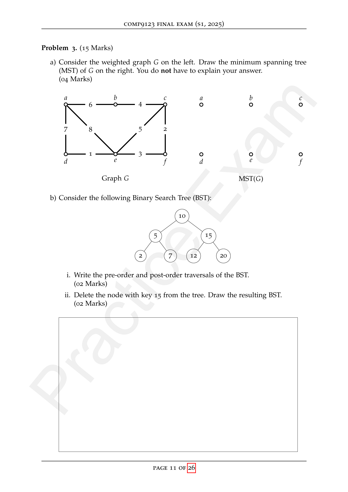

# COMP9123 — Practice Exam (Semester 1, 2025)

> `9123/复习/COMP9123 S2 - Practice Exam.pdf` · 4 × 15 = 60 · 2h + 10min reading · RESTRICTED OPEN


计算器（非编程）+ A4 笔记双面 · 题后作答；续写见原卷 p20–26 并注明题号。

---

## Problem 1. (15 Marks) <span style="color: #e67e22">W1–W3 · ADT / 动态结构 / 复杂度</span>

Consider the **Dynamic Matrix** ADT for an $n \times n$ matrix $A = \{a_{i,j}\}_{1 \le i,j \le n}$:

- **create()** — creates $1 \times 1$ with $a_{1,1} = 0$
- **set(i, j)** / **get(i, j)** — set or get $a_{i,j}$
- **increase-size** — from $n \times n$ to $(n+1) \times (n+1)$; keep $a_{i,j}$ for $1 \le i,j \le n$, new entries $0$

Design an implementation with **O(n²)** space; **create**, **set**, **get** in **O(1)**; **increase-size** in **O(n)**.

**(a)** Describe your data structure in plain English. **(07 Marks)**

**(b)** Write structured pseudo-code for part (a). **(05 Marks)**

**(c)** Analyze time and space complexity using Big-O. **(03 Marks)**

> [!note]- Answer
>
> ### 大白话（先懂再写英文）
>
> **(a)** 别用「一整块 $n \times n$ 大数组」——扩容要把旧格子全抄一遍，太慢。改成 **「一个数组，里面放 n 条行」**：每条行自己是一小段数组。查/改就是：找到第 i 行，再取第 j 个格子，一步到位。变大一圈时：老行每条末尾多塞一个 0（新加的那一列），再单独造一条全新的底行，也全是 0。旧数不用动，新行新列自然满足题目。
>
> **(b)** 按上面想法写四段伪代码：`create` 造 1×1；`get`/`set` 用 `rows[i-1][j-1]`；`increase-size` 循环给每行 append 一个 0，再 `rows[n]` 放一条新的全 0 行，`n` 加 1。
>
> **(c)** 造 1×1 是常数时间；读写一个格子是常数时间；变大一圈只碰 **n 个新格子**（n 行各加一个 + 一行 n+1 个），所以是 **O(n)**，不是 O(n²)。一共存 $n^2$ 个数，空间 **O(n²)**。
>
> ---
>
> ### English（得分点）
>
> **(a)** Array of $n$ row arrays `rows`; field `n` = current size. `get`/`set`: `rows[i-1][j-1]`. **increase-size**: append 0 to each of $n$ rows, add one new zero row of length $n+1$, $n \leftarrow n+1$. Avoid flat $n^2$ array (resize would copy $O(n^2)$).
>
> **(b)**
>
> ```
> create(): n←1; rows←[array[0]]
> get(i,j): return rows[i-1][j-1]
> set(i,j,v): rows[i-1][j-1]←v
> increase-size():
>     for r←0..n-1: append 0 to rows[r]
>     rows[n]←new array[n+1] of 0s; n←n+1
> ```
>
> **(c)** create, get, set: $O(1)$. increase-size: $O(n)$ ($n$ appends + one new row). Space: $O(n^2)$.

---

## Problem 2. (15 Marks) <span style="color: #e67e22">W8–W9 · 生成树 / 图算法设计</span>

Let $G$ be a connected undirected graph on $n$ vertices. Two distinct spanning trees $T$ and $S$ are **one swap away** if $|T \cap S| = n - 2$ (they differ in exactly one edge).

$R_1, R_2, \ldots, R_k$ is a **swapping sequence** from $T$ to $S$ if $R_1 = T$, $R_k = S$, and for each $1 \le i < k$, $R_i$ and $R_{i+1}$ are one swap away.

Given $G$ and spanning trees $T$ and $S$, design a **polynomial-time** algorithm that constructs a **minimum-length** swapping sequence.

**(a)** Describe your algorithm in plain English. **(07 Marks)**

**(b)** Prove correctness. **(05 Marks)**

**(c)** Analyze time complexity. **(03 Marks)**

> [!note]- Answer
>
> ### 大白话
>
> **(a)** 当前树 $R$ 从 $T$ 开始。只要 $R \neq S$：在 $R$ 里找一条 $S$ 没有的边 $e$，在 $S$ 里找一条 $R$ 没有的边 $f$，保证「去掉 $e$、加上 $f$」还是生成树，就换一步。重复直到等于 $S$。步数 = 一开始 $T$ 和 $S$ 差几条边（记 $k$），就换 $k$ 次。
>
> **(b)** 每次换完仍是生成树；$k$ 步后 $R=S$。至少也要 $k$ 次（每步最多纠正一条「多出来的边」），所以最短。
>
> **(c)** 每步用 DFS/BFS 在 $R \cup \{f\}$ 里找环决定可换的 $f$，$O(n+m)$；最多 $k \le n-1$ 步 → 总 $O(n(n+m))$，多项式。
>
> ---
>
> ### English（得分点）
>
> **(a)** Let $R \leftarrow T$, sequence $[T]$. While $R \neq S$: pick $e \in R \setminus S$, pick $f \in S \setminus R$ s.t. $R' = (R \cup \{f\}) \setminus \{e\}$ is a spanning tree (unique cycle in $R \cup \{f\}$ contains $e$), set $R \leftarrow R'$, append $R$. Stop when $R = S$.
>
> **(b)** Each step is a valid one-swap move. $|R \setminus S|$ drops by 1 each iteration → reaches $S$ in $k = |T \setminus S|$ steps. Any sequence needs $\ge k$ swaps (each swap fixes at most one edge of $R \setminus S$), so length is minimum.
>
> **(c)** $O(k \cdot (n+m)) = O(n(n+m))$ polynomial; each exchange found via cycle check on $R \cup \{f\}$.

---

## Problem 3. (15 Marks) <span style="color: #e67e22">W4–W5, W9</span>

**(a)** Consider weighted graph $G$ on the left. Draw the **MST** on the right. No explanation required. **(04 Marks)** <span style="color: #3498db">W9 · MST</span>



| a–b | b–c | a–d | b–d | d–e | e–f | c–e | b–e |
|-----|-----|-----|-----|-----|-----|-----|-----|
| 6 | 4 | 7 | 8 | 1 | 3 | 5 | 2 |

**(b)** BST above (root **10**).

- **(i)** Pre-order and post-order traversals. **(02 Marks)** <span style="color: #3498db">W5</span>
- **(ii)** Delete key **15**; draw the resulting BST. **(02 Marks)**

**(c)** Design a structure for real-time score ranking: **insert** a score and **query median**, both **O(log n)** per operation. Use an **augmented AVL tree**; explain what each node stores, how it is maintained on insert/rotation, and how the median is found without sorting. **(07 Marks)** <span style="color: #3498db">W4 · AVL 增广</span>

> [!note]- Answer
>
> ### 大白话
>
> **(a)** 边按权从小到大选（Kruskal）：d–e(1), b–e(2), e–f(3), b–c(4), a–b(6)；c–e、b–d、a–d 会成环不要。MST 五条边，总权 16。
>
> **(b)(i)** 先序：根→左→右 → `10, 5, 2, 7, 15, 12, 20`。后序：左→右→根 → `2, 7, 5, 12, 20, 15, 10`。
>
> **(b)(ii)** 删 15：有两个孩子，用左子树最大（前驱）**12** 顶替 15，再删掉原来的 12 叶子。结果：根 10，右子 12，12 的右孩子 20。
>
> **(c)** AVL 每个结点多存 **`size` = 子树结点个数**。插入/删除/旋转时像更新高度一样更新 `size`。找中位数：看根左子树大小，决定往左/根/往右（和「按名次查找」一样），$O(\log n)$。
>
> ---
>
> ### English（得分点）
>
> **(a) MST edges:** $\{d\text{-}e,\, b\text{-}e,\, e\text{-}f,\, b\text{-}c,\, a\text{-}b\}$ (weights $1,2,3,4,6$; total $16$). *(Draw on exam figure.)*
>
> **(b)(i)** Pre-order: `10, 5, 2, 7, 15, 12, 20`. Post-order: `2, 7, 5, 12, 20, 15, 10`.
>
> **(b)(ii)** Delete 15 (two children): replace with inorder predecessor **12**, delete old 12. Result: root 10; right child 12 with right child 20; left subtree unchanged $(2,5,7)$.
>
> **(c)** Augmented AVL: each node stores **`size`** (subtree node count). Update `size` on insert/delete/rotate. **Median:** let $k = \lceil n/2 \rceil$; at node $v$, if `left.size ≥ k` go left; else if `left.size + 1 ≥ k` return $v$; else search right with $k - \text{left.size} - 1$. Insert + rebalance: $O(\log n)$; query: $O(\log n)$.

---

## Problem 4. (15 Marks) <span style="color: #e67e22">W11 · 分治 / 证明 / 复杂度</span>

Array $A$ has $n$ distinct integers (transponder locations); range $d$. Pair $(i,j)$ communicates iff $|A[i] - A[j]| \le d$. Count communicating pairs.

**Example:** $A = [4, 2, 12, 7]$, $d = 3$ → **2** ($|4{-}2| \le 3$, $|4{-}7| \le 3$; no other pair).

**(a)** Divide-and-conquer algorithm in **O(n log n)**; explain in plain English. **(08 Marks)**

**(b)** Argue correctness. **(05 Marks)**

**(c)** Time complexity (Big-O). **(02 Marks)**

> [!note]- Answer
>
> ### 大白话
>
> **(a)** 先按位置 **排序**（或归并排序同时计数）。分治：左半内部能配对的数、右半内部能配对的数，再加上 **左×右** 跨两半、距离 $\le d$ 的对数。左右已排序时，对每个左端点用双指针扫右半「值在 $[A[i]-d,\, A[i]+d]$」里的个数。三层加起来就是答案。
>
> **(b)** 每一对下标只属于：全在左、全在右、或跨中点两侧；跨中点只在 `countCross` 里数一次，不漏不重。
>
> **(c)** 归并层数 $O(\log n)$，每层 `countCross` 扫一遍 $O(n)$ → **$O(n \log n)$**。
>
> ---
>
> ### English（得分点）
>
> **(a)** Sort $A$ by value. `count(l,r)`: if $l \ge r$ return 0; split at `mid`; return `count(l,mid) + count(mid,r) + countCross(A[l..mid], A[mid..r], d)` where both halves are sorted. **countCross:** for each $x$ in left, two-pointer count $y$ in right with $x-d \le y \le x+d$.
>
> **(b)** Every pair lies entirely in left, entirely in right, or one index each side; D&C sums disjoint cases; cross pairs counted exactly once when halves are processed.
>
> **(c)** Recurrence $T(n)=2T(n/2)+O(n)$ → **$O(n \log n)$**.
