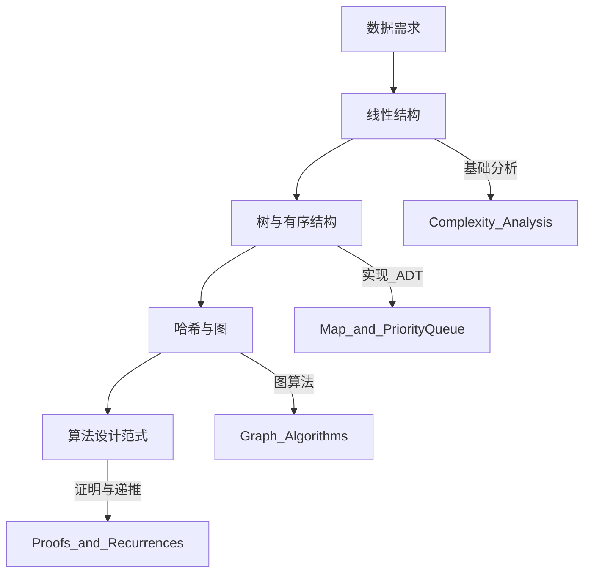
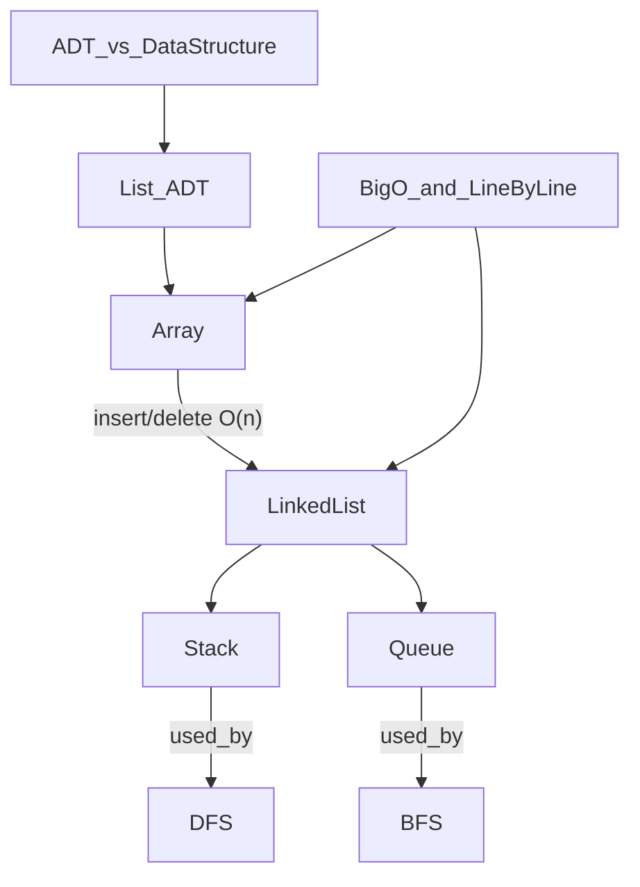
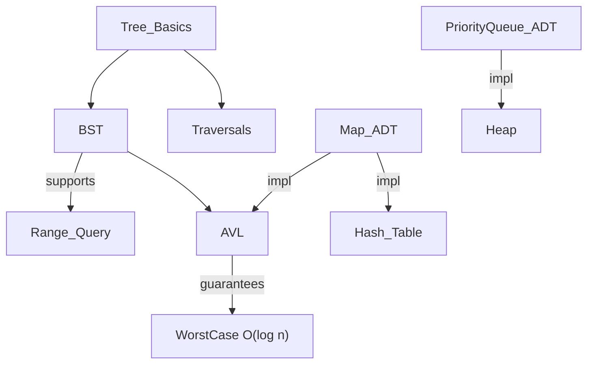
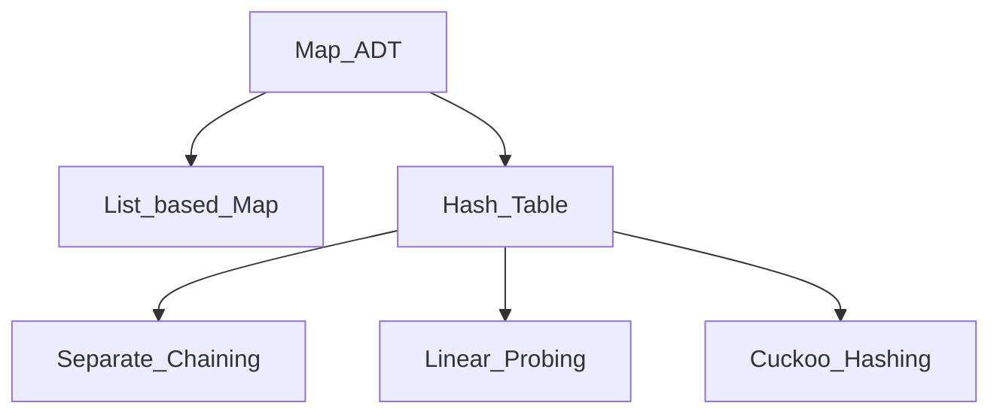
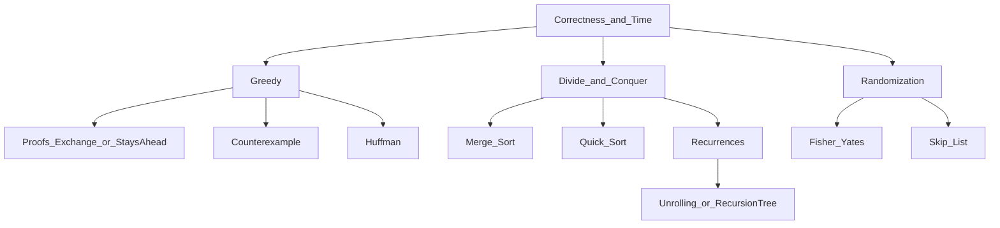

# COMP9123 知识图谱（Concept Map）

> 目的：把课程知识点之间的 **实现/依赖/对比/应用** 关系串起来，形成“从抽象到实现到算法”的全局视图。  
> 详细推导与例题：回到 `复习笔记/`；期末角度：看 `期末考点总览.md` 与 `期末考试规范.md`。

---

## 0. 怎么读这张图

### 关系类型（边的语义）

- **实现于**：ADT → data structure / representation  
  - 例：`Map ADT →(实现于) Hash Table`
- **依赖/使用**：algorithm → required data structure  
  - 例：`Dijkstra →(依赖) Priority Queue`
- **对比/权衡**：A ↔ B（trade-off）  
  - 例：`Hash Table ↔ AVL Tree（Map 实现：O(1) avg vs O(log n) worst + range query）`
- **产生/动机**：前者的局限引出后者  
  - 例：`数组 insert/delete O(n) →(动机) 链表`
- **被用于**：概念/结构 → 典型场景/算法  
  - 例：`Queue →(用于) BFS`

### 资料入口（从图回到细节）

- **Group1**：[复习笔记/第一组 线性数据结构.md](../复习笔记/第一组%20线性数据结构.md)
- **Group2**：[复习笔记/第二组 树与有序结构.md](../复习笔记/第二组%20树与有序结构.md)
- **Group3**：[复习笔记/第三组 哈希与图.md](../复习笔记/第三组%20哈希与图.md)
- **Group4**：[复习笔记/第四组 算法设计范式.md](../复习笔记/第四组%20算法设计范式.md)
- **Practice Exam（四题）**：[测试/考试模拟题/老师给考试题 1.md](../测试/考试模拟题/老师给考试题%201.md)

---

## 1. 全局节点清单（按四组）

> 下列是“知识图谱节点”的最小集合。后面的 Mermaid 图只会画这些节点与关键边。

### Group 1 — 线性结构与分析（W1–W3）

- **抽象/分析**
  - ADT vs Data Structure（抽象与实现）
  - Complexity Analysis：Big-O / worst-case / line-by-line
- **线性表示**
  - Array（连续内存，index access）
  - List ADT（get/set/add/remove 等）
  - Linked List：Singly / Doubly / Circular
- **受限结构**
  - Stack ADT（LIFO）
  - Queue ADT（FIFO）
- **典型考法/应用**
  - pointer tracing（插入/删除）
  - nested loop complexity
  - Stack 用于括号匹配 / 调用栈

### Group 2 — 树与有序结构（W4–W6）

- **Tree 基础**
  - Rooted Tree / height / depth / subtree / traversals（pre/in/post）
- **搜索树**
  - BST：search/insert/delete（successor/predecessor）
  - Balanced BST：AVL（rotation / height maintenance）
- **ADT 与实现**
  - Map ADT（sorted vs unsorted）
  - Priority Queue ADT
  - Heap（Priority Queue 常见实现）
- **典型考法/应用**
  - traversal 写法 + 追踪
  - delete case（0/1/2 children）
  - range query（BST/AVL）

### Group 3 — 哈希与图（W7–W9）

- **Map 实现路线**
  - List-based Map（O(n)）
  - Direct Addressing（空间爆炸）
  - Hash Table：hash code + compression; load factor; rehashing
  - Collision handling：Separate Chaining / Linear Probing / Cuckoo Hashing
- **图基础**
  - Graph definitions + properties
  - Graph representations：Adjacency List / Matrix
- **图遍历与算法**
  - BFS（Queue）
  - DFS（Stack / recursion）
  - Shortest Path：Dijkstra（Priority Queue）
  - MST：Kruskal / Prim（Union-Find / Priority Queue）

### Group 4 — 算法设计范式（W10–W12）

- **Greedy**
  - greedy template
  - proof：exchange argument / stays-ahead
  - counterexample（反例）
  - classic：Fractional Knapsack / Huffman
- **Divide & Conquer**
  - D&C template（split/solve/merge）
  - Merge Sort / Quick Sort
  - recurrence solving（unrolling / recursion tree）
  - selection（median-of-medians / quickselect）
- **Randomization**
  - Fisher–Yates shuffle
  - Skip List（期望 O(log n)）

---

## 2. 关键“实现关系”清单（考试最常用）

### Map ADT 的实现选型（核心对比）

- `Map ADT → Hash Table`：平均 O(1)，但 worst-case 可退化；无序不擅长 range query
- `Map ADT → AVL Tree (Sorted Map)`：worst-case O(log n)，支持 range query / order operations
- `Map ADT → Unsorted List`：get/remove O(n)，仅在 n 小或写多读少场景可接受

### Priority Queue ADT 的实现选型（高频）

- `Priority Queue → Heap`：insert/extract-min O(log n)
- `Dijkstra → Priority Queue`：用于快速取当前最小距离点

### 图算法与基础结构的依赖

- `BFS → Queue`
- `DFS → Stack / recursion`
- `Kruskal → Union-Find`
- `Prim → Priority Queue`

---

## 3. Mermaid 图区域

> 下面的图只画“最关键的边”，保证一屏能看懂；细节请点回 `复习笔记/`。

### 3.1 全局主干（从需求到范式）



### 3.2 Group 1（W1–W3）：线性结构 + 分析

故事线：ADT 定义“你能做什么”，数据结构决定“你怎么做”；Big-O 是统一评估工具。数组访问快但插删慢 → 链表解决动态增删 → 栈/队列是链表的受限接口；并且直接支撑 BFS/DFS 这类图算法。



### 3.3 Group 2（W4–W6）：树 → BST → AVL → ADT 实现

故事线：线性搜索太慢 → 用树减少搜索空间；BST 给出有序搜索但可能退化 → AVL 用旋转保证高度 O(log n)。在此基础上实现 Sorted Map / Priority Queue 等抽象 ADT。



### 3.4 Group 3（W7–W9）：Map 的哈希实现 + 图算法依赖

故事线：Map 要更快的查找 → 哈希把 key 压缩到数组下标，但必须处理碰撞与扩容。现实关系用图建模 → 表示法影响空间/时间；遍历与最短路/MST 依赖 Queue/Stack/PQ/Union-Find。



```mermaid
flowchart TB
  graph[Graph] --> repr[Graph_Representation]
  repr --> adjList[Adjacency_List]
  repr --> adjMatrix[Adjacency_Matrix]

  graph --> BFS2[BFS]
  graph --> DFS2[DFS]
  graph --> dijkstra[Dijkstra]
  graph --> mst[MST]

  BFS2 -->|needs| queue2[Queue]
  DFS2 -->|needs| stack2[Stack]
  dijkstra -->|needs| pq2[PriorityQueue]
  mst --> kruskal[Kruskal]
  mst --> prim[Prim]
  kruskal -->|needs| unionFind[Union_Find]
  prim -->|needs| pq3[PriorityQueue]
```

### 3.5 Group 4（W10–W12）：范式 × 证明 × 复杂度

故事线：同样的问题可以用不同范式解：贪心快但要证明或找反例；分治靠递推算复杂度；随机化用概率换取结构简单与期望效率。期末常把“正确性 + 复杂度”当固定要求。



